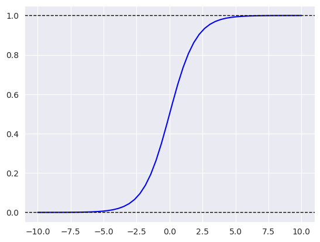

# 3. Machine Learning for Classification

- 3.1 [Churn prediction project](#01-churn-project)
- 3.2 [Data preparation](#02-data-preparation)
- 3.3 [Setting up the validation framework](#03-validation)
- 3.4 [EDA](#04-eda)
- 3.5 [Feature importance: Churn rate and risk ratio](#05-risk)
- 3.6 [Feature importance: Mutual information](#06-mutual-info)
- 3.7 [Feature importance: Correlation](#07-correlation)
- 3.8 [One-hot encoding](#08-ohe)
- 3.9 [Logistic regression](#09-logistic-regression)
- 3.10 [Training logistic regression with Scikit-Learn](#10-training-log-reg)
- 3.11 [Model interpretation](#11-log-reg-interpretation)
- 3.12 [Using the model](#12-using-log-reg)
- 3.13 [Summary](#13-summary)
- 3.14 [Homework](#homework)

<a id="01-churn-project"></a>
## 3.1 Churn prediction project

**The notebook of this section**: [section3-notebook](notebooks/section3-notebook.ipynb) 

### Churn Prediction
- "Churn" is the process of stopping to rely on the services of one company and moving to another company for those services 
- Predicting which customers are about to churn
- Cusomters are scored with probabilities to find out which customer is most likely to churn
- Goal is to find possible causes of "churn" and how to mitigate them, in order to hold a customer
    - **Example:** Sending a customer a promotional email with an interesting offer
- Churn Prediction is a `Binary Classification`-Problem

### Binary Classification
$$g(x_i) \approx y_i$$
- $x_i$: $i$-th customer (it's features)
- $y_i\in\{0, 1\}$: Binary label 

At inference you obtain the likelihood of churning from the model $g(x_i)$, which is in $[0, 1]$.


<a id="02-data-preparation"></a>
## 3.2 Data preparation

- Required for better usability of data
- Getting an overview over the data (not yet EDA)
- In this step data is read in and pre-processed
    - Missing data is handled (replacing missing values, dropping rows with missing values, ...)
- Type conversions of columns are done, if required


<a id="03-validations"></a>
## 3.3 Setting up the validation framework

- Splitting data in the training-/validation- und test-data
- 2-step approach is used to obtain a 3-way split of the data
    - *1st split*: Full-Train (80%), Test (20%)
    - *2nd split*: Full-Train $\rightarrow$ Train (60%), Val (20%)

<a id="04-eda"></a>
## 3.4 EDA

- Important step in machine learning and data science
- Used to get a deeper insight into the data-set at hand
- Extracted knowledge from this step can be beneficial or even crucial for successfull training
- Visualization of data is an important component in EDA
    - Relations of data could be discovered by comparing data with different plots

<a id="05-risk"></a>
## 3.5 Feature importance: Churn rate and risk ratio

- Used for categorical variables
- Churn rate is the number of churning customers divided by all customers
- Churn rate can also be more granular by looking at the churn rate for certain features
    - *Example Question*: are male or female customers more likely to churn?

- **Feature-Importance**
    1. **Difference** = GLOBAL - GROUP
        - $\text{Difference} > 0$: Group is less likely to churn
        - $\text{Difference} < 0$: Group is more likely to churn
    2. **Risk Ratio** = GROUP / GLOBAL
        - $\text{Risk} > 1$: Group is more likely to churn
        - $\text{Risk} < 1$: Group is less likely to churn

- Both Difference and Risk Ratio tell us the same information, but in a different way.
- Only tells the importance of a certain value of a feature but not the feature overall


<a id="06-mutual-info"></a>
## 3.6 Feature importance: Mutual information

- Used for categorical variables
- Tells us the importance of a feature for a model
- **Mutual information**: 
    - Measure of mutual dependence between 2 varaibles
    - The amount of information we get about one variable by ovserving another variable
- **Application here**:
    - How much do we learn about the variable `churn` by observing another variable in the data?


<a id="07-correlation"></a>
## 3.7 Feature importance: Correlation

- Link: https://en.wikipedia.org/wiki/Pearson_correlation_coefficient

- **Formula**: $r = \frac{\sum_i(x_i-\bar x)(y_i-\bar y)}{\sqrt{\sum_i(x_i-\bar x)^2\sum_i(y_i-\bar y)^2}}\in[0, 1]$

- Used for numerical varaibles
- Measures how much 2 variables change together / dependency between 2 variables
    - If one variable grows, the other grows as well

- **Example**: Correlation of `tenure` and `churn`
    - <u>Positive</u> More `tenure` $\rightarrow$ Higher `churn`
    - <u>Negative</u> More `tenure` $\rightarrow$ Less `churn`
    - <u>Zero</u> No effec on `churn`


<a id="08-ohe"></a>
## 3.8 One-hot encoding

- Special type of numerical encoding of categorical variables, that can easily be read by ML models
- Converts every categorical value into an vector of the length of the different possible categories within a varaible
- Has a singular $1$ in it at the position of the corresponding class
- **Example**:
    - Given: $y\in\{1, 2, 3\}$, with 3 categories in it (the vector size)
    - You get
        - $y_1 = [1, 0, 0]^T$
        - $y_2 = [0, 1, 0]^T$
        - $y_2 = [0, 0, 1]^T$
    
    - A given set of target variables $\tilde y = [3, 1, 2, 1, 2, 2]$ will result in a matrix of 6 rows and 3 columns. The rows are for entries of the original $\tilde y$ and the columns are for encoding the value with $0$'s and one singular $1$.
$$
\text{1H-Encoding}([3, 1, 2, 1, 2, 2]) = 
\begin{bmatrix}
    0 & 0 & 1 \\
    1 & 0 & 0 \\
    0 & 1 & 0 \\
    1 & 0 & 0 \\
    0 & 1 & 0 \\
    0 & 1 & 0 \\
\end{bmatrix}
$$

Code:
```python
from sklearn.feature_extraction import DictVectorizer

dv = DictVectorizer(sparse=False)
# Create Dictionaries from dataframe
dicts = df[columns].to_dict(orient="records")
# Detect required categories needed for 1HE
dv.fit(dicts)
# Transform categorical values according to the learned properties of the data from `fit`
data = dv.transform(dicts)

# `fit` and `transform` in one call
data = dv.fit_transform(dicts)
```

<a id="09-logistic-regression"></a>
## 3.9 Logistic regression

- Linear model that is used for classification
- Instead of $y\in\mathbb{R}$ like with Linear Regression, Logistic Regression has categorical outputs
- Logistic regression takes the function $g(x_i)\approx y_i$ from Linear Regression and applies the sigmoid function $\sigma(z) = \frac{1}{1 + e^{-z}}$. This transforms the function to a probability, because the range of $\sigma\in[0, 1]$ for all possible inputs.
    - $\sigma(g(x_i)\in\mathbb{R}) = \frac{1}{1 + e^{-(w_0 + w^Tx_i)}}\in[0, 1]$
- Classification threshold is usually chosen at the center of the sigmoid function at $(x, y) = (0, 0.5)$.



<a id="10-training-log-reg"></a>
## 3.10 Training logistic regression with Scikit-Learn

**Example code:**
```python
from sklearn.linear_model import LogisticRegression

# Defining and Training LogReg-Model
model = LogisticRegression()
model.fit(X_train, y_train)

# Get the prob. of positive result
y_pred = model.predict_proba(X_val)[:, 1]
churn_decision = (y_pred >= 0.5)  # list of booleans

# Aggregation of results
df_pred = pd.DataFrame()
df_pred["probability"] = y_pred
df_pred["prediction"] = churn_decision.astype(int)
df_pred["actual"] = y_val
df_pred["correct"] = df_pred["prediction"] == df_pred["actual"]

# Accuracy metric results in %
print(f"Accuracy: {df_pred['correct'].mean()*100.0:.2f}%")
```

<a id="11-log-reg-interpretation"></a>
## 3.11 Model interpretation

- The Coefficients of a trained Logistic Regression model give information how certain features influence the output score
- Model coefficients are often also called model "weights".
- The magnitude of weights relate to the risk-ratio of the given feature

**Example-Computation:**
- **Used Features:** `contract`, `monthlycharges`, `tenure`
- **Input**: $x_i = [\underbrace{1, 0, 0}_{\text{contract}}, \underbrace{50}_{\text{monthlycharges}}, \underbrace{5}_{\text{tenure}}]$
- **Weights**: $w = [0.97, -0.025, -0.949, 0.027, -0.036]$

$$
\text{score} = w_0 + w^Tx_i = w_0 + \sum_j w_j\cdot x_{i,j} = \\
\begin{align*}
-2.47 &+ \underbrace{\mathbf{1}\cdot\overbrace{0.97}^{M} + \mathbf{0}\cdot\overbrace{(-0.025)}^{1Y} + \mathbf{0}\cdot\overbrace{(-0.949)}^{2Y}}_{\text{(contract)}} \quad\quad \text{with } x_{i,1:3}^{\text{contract}} = [1, 0, 0] \\
      &+ \mathbf{50}\cdot 0.027 \quad\quad \text{(monthlycharges)} \\
      &+ \mathbf{5}\cdot (-0.036) \quad\quad \text{(tenure)} \\
      &= -0.337 \\
      \sigma(\text{score} = -0.337) = 0.417 < 0.5 \quad \leadsto \quad \hat y = 0
    
\end{align*}
$$
    

<a id="12-using-log-reg"></a>
## 3.12 Using the model

**Code of Example usage**:
```python
### Data pre-processing ###
# Training data
dicts_train = df_train[categorical + numerical].to_dict(orient="records")
dv = DictVectorizer(sparse=False)
X_train = dv.fit_transform(dicts_train)
y_train = df_train["churn"].values

# Test data
dicts_test = df_test[categorical + numerical].to_dict(orient="records")
X_test = dv.transform(dicts_test)
y_test = df_test["churn"].values

### Training of LogReg model ###
model = LogisticRegression()
model.fit(X_full_train, y_full_train)

# Computing of accuracy metric
y_pred = model.predict_proba(X_test)[:, 1]
churn_decision = (y_pred >= 0.5)
accuracy = (churn_decision == y_test).mean()

print(f"accuracy: {accuracy*100:.2f}%")
```

<a id="13-summary"></a>
## 3.13 Summary

- **Feature importance**: 
    - risk, mutual information, correlation
- **One-hot encoding**: 
    - can be implemented with `DictVectorizer`
- **Logistic Regression**: 
    - linear model like linear regression
    - uses linear regression model as score and applies sigmoid function to it
- **Output of Logistic Regression**: 
    - probability
- **Interpretation of weights/parameters**: 
    - similar to linear regression

<a id="homework"></a>
## 3.14 Homework
- The Questions can be found [here](homework/homework.md)
- The Answers can be found [here](homework/solution.ipynb)