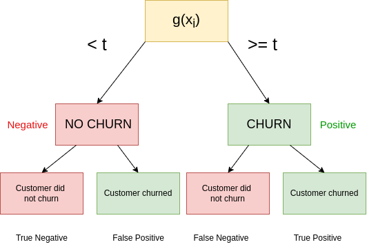
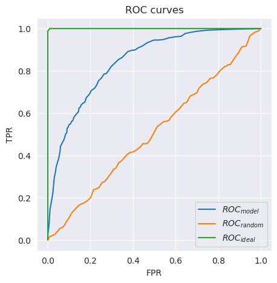
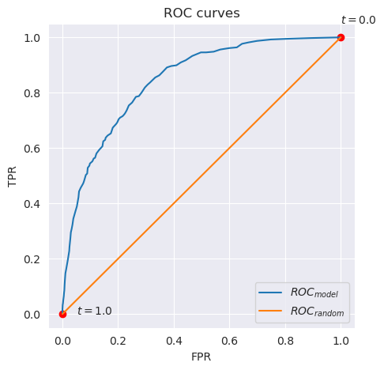
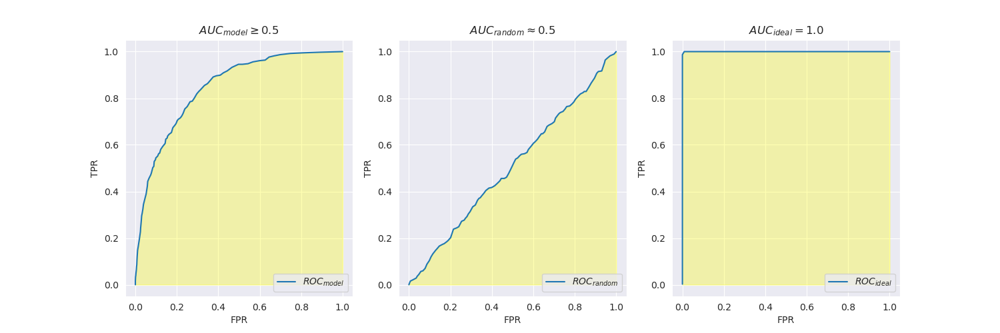

# 4. Evaluation Metrics for Classification

- 4.1 [Evaluation metrics: session overview](#01-overview)
- 4.2 [Accuracy and dummy model](#02-accuracy)
- 4.3 [Confusion table](#03-confusion-table)
- 4.4 [Precision and Recall](#04-precision-recall)
- 4.5 [ROC Curves](#05-roc)
- 4.6 [ROC AUC](#06-auc)
- 4.7 [Cross-Validation](#07-cross-validation)
- 4.8 [Summary](#08-summary)
- 4.9 [Explore more](#09-explore-more)
- 4.10 [Homework](#homework)


<a id="01-overview"></a>
## 4.1 Evaluation metrics: session overview

In [Week 3](../03-classification/README.md) we looked at the problem of `Churn Prediction`, where we built a model (Logistic Regression) for scoring existing customers and assigning probabilities of a customer leaving the company.

In this section we look into other ways to evaluate binary models.

The code of this section can be found in the accomanying notebook [here](notebooks/section4-notebook.ipynb).


<a id="02-accuracy"></a>
## 4.2 Accuracy and dummy model

### Accuracy calculation explanation (6 samples)
The accuracy is the number of correct predictions divided by all predictions. 
```python
predictions: [1] [1] [1] [1] [0] [0]
real labels: [1] [0] [0] [1] [0] [1]
-------------------------------------
correct?     [1] [0] [0] [1] [1] [0]
correct predcitions: 3
accuracy: 3 / 6 = 1 / 2 = 0.5
```

### Example for Accuracy on all customers
Here we look at the validation set, that has 1409 customers. Prediction is done (for now) with a decision threshold of $0.5$. This results in the following numbers:
```bash
all:     1409
correct: 1132
-------------
accuracy: 1132 / 1409 = 0.8034 (80%)
```

The code for this looks like this:
```python
y_pred = model.predict_proba(X_val)[:, 1]
churn_decision = (y_pred >= 0.5)
acc = (y_val == churn_decision).mean()
print(f"accuracy: {acc:.2f} | {acc*100:.2f}%")
```


### Is the used churn threshold good?
- The dscision threshold at $t = 0.5$ is not fixed but can be changed.
- Changing the threshold can change the accuracy (better or worse) and has to be tested with different values between $0$ and $1$.

### Accuracy metric from `scikit-learn`
- There is already a function in `scikit-learn` to compute the accuracy of a model, provided the predictions and true labels
```python
from sklearn.metrics import accuracy_score
score = accuracy_score(y, y_pred)
```

### Interpreting the first and last threshold ($t = 0$ and $t = 1$)
- $t = 1$: Here the threshold is set so high, that everything is classified as `False`
- $t = 0$: Here the threshold is set so low, that everything is classified as `True` 

### Why bother? Comparing the accuracy of our model to the dummy model
The model, that classifies every customer of non-churning ($t = 1$) still has an accuracy of about $73\\%$. With this we now have 2 models:
| `Model`    | `Accuracy` |
| ---------- | ---------- |
|  Our Model |   $80\\%$   |
| Dummy Model|   $73\\%$   |

There is only a $7\\%$ difference between the best model and a "deficient" model. The accuracy is all nice and good, however ins such situations it can be insufficient and other metrics have to be looked at. 


### Issues due to class imbalances in datasets
The relatively high accuracy in the dummy model is caused by class-imbalance. The distribution of the classes here is:
- **Non-Churning**: $\approx 73\\%$
- **Churning**: $\approx 27\\%$  

There are clearly more non-churning chustomers. This directly results in an accuracy of $73\\%$ in when threshold is $t = 1.0$. With such an imbalance you can achieve a reasonably good accuracy while applying a brute force "everything is true" or "everything is false" at the $0$ and $1$ thresholds. To get a better insight into the performance of the trained model, other metrics and different types of errors are being considered, that are examined in the following sections.


<a id="03-confusion-table"></a>
## 4.3 Confusion table
- Table that is used to store different types of errors
- **There are two types of errors**:
    - <u>False Positive</u>: True (No churn) & Predicted (churn)
    - <u>False Negative</u>: True (churn) & Predicted (No churn)

- Visualization of the different possible predictions:



- In table form we get this (numbers come from this sections notebook!)

**Predictions**
|  True \ Predicted | $g(x_i) < t$  (Negative) | $g(x_i) \ge t$  (Positive) | 
| ----------------- | ------------------------ | -------------------------- |
| $y=0$ (Negative)  | **`TN`**: 922 (65%)      | **`FP`**: 101 (8%)         |
| $y=1$ (Positive)  | **`FN`**: 176 (12%)      | **`TP`**: 210 (15%)        | 

- We can derive the `Accuracy` metric from the values from the confusion matrix:
     - $\text{accuracy} = \frac{\text{tp} + \text{tn}}{\text{tn} + \text{fp} + \text{fn} + \text{tp}}$

### Conclusion
- The confusion matrix helps to analyze what type of error we make


<a id="04-precision-recall"></a>
## 4.4 Precision and Recall

The metrics of this section can be constructed from the entries of the confusion matrix (`tp`, `tn`, `fp`, `fn`).

### Precision Definition
- Fraction of positive predictions that are correct
- $\textbf{precision} = \frac{tp}{tp + fp}$
```python
# Computation example
true label:      [1] [0] [1] [1]
predicted churn: [1] [1] [1] [1]
--------------------------------
correct:         [1] [0] [1] [1] 
tp = 3, fp = 1
precision = tp / (tp + fp) = 3 / 4 = 0.75
```

## Recall Definition
- Fraction of correctly identified positive examples (churning users)
- $\textbf{recall} = \frac{tp}{tp + fn}$

```python
# Computation example           
                    < t                   >= t 
 true label:  [0] [0] [0] [1]   |   [1] [0] [1] [1]
 predictions: [0] [0] [0] [0]   |   [1] [1] [1] [1]                

correct (positive):       [0]       [1]     [1] [1]
                          fn        tp      tp  tp
tp = 3, fn = 1
recall = tp / (tp + fn) = 3 / 4 = 0.75

```

### Why Accuracy is misleading
We have the following results from the given data:
- $\text{precision} = \frac{tp}{tp + fp} = 67\\%$
- $\text{recall} = \frac{tp}{tp + fn} = 54\\%$
- $\text{accuracy} = \frac{tp + tn}{tp + tn + fp + fn} = 80\\%$

**Insights from the 3 metrics**:
- Even though the accuracy is relatively high, the model is not that good. This can be caused by imbalanced data coupled with a ill-chosen decision-threshold at $t = 0$ or $t = 1$.
- To see if the model is good overall, you have to look at the `precision` and `recall` in conjunction with the `accuracy`.
    - `Precision`: Looking at all the customers, that we think are abount to churn (tp + fp) and what fraction of this is correctly classified (tp) as churning.
    - `Recall`: Looking at all the customers, that are actually churning (tp + fn) and what fraction of this is correctly classified (tp) as churning.

<a id="05-roc"></a>
## 4.5 ROC Curves

- **R**eviever **O**perating **C**haracteristics
- A way of describing the performance of binary classification methods
- We are interestedin 2 numbers:
    - `FPR`: False Positive Rate
    - `TPR`: True Positive Rate
- `FPR` and `TPR` can be computed from the confusion matrix
    - `FPR` uses `tn` and `fp` (we want to minimize `fp`)
    - `TPR` uses `fn` and `tp` (we want to maximize `tp`)


|  true \ pred  | $g(x_i) < t$ (Negative) | $g(x_i) \ge t$ (Positive) |                 |
| ------------- | ----------------------- | ------------------------- |---------------- |
| $y = 0$       |        **`TN`**         |         **`FP`**          | $\text{FPR} = \frac{FP}{FP + TN}$ | 
| $y = 1$       |        **`FN`**         |         **`TP`**          | $\text{TPR} = \frac{TP}{TP + FN}$| 

- The ROC curve computes the `TPR` and `FPR` for all possible threshold.
- Optimally we want to maximize the `TPR` and minimize the `FPR`.

**Curve of Random Model**
- Basically a binary coin-toss model
- See section notebooks

**Ideal Model**
- The best model (usually not attainable)
- See section notebook

**ROC-Curve**
- A plot of `FPR` on the x-axis and `TPR` on the y-axis
- **Goal**: The curve should be as far away from the random curve (here: the linear line in the middle) and as near as possible to the top (1.0) of the plot



**Lets look at the curve of the `model` and analyze some points on it**



- *For reference*:
    - $\text{TPR} = \frac{TP}{TP + FN}$
    - $\text{FPR} = \frac{FP}{FP + TN}$

- $\text{FPR} = \text{TPR} = 0$: This is the case when the decision threshold of the model is $1.0$.
    - Everyone is predicted as false (`non-churning`) and s.t. the `tp`-values go to 0.
    - There are no `fp`-values as well, since everything is classified as negative (`non-churning`)
- $\text{FPR} = \text{TPR} = 1$: This is the case if the model predicts everything as true (`churning`), which means that the decision threshold is $t = 0.0$
    - Everyone is predicted as true (`churning`), which means that all `tp`-values are correctly identified (100% / 1.0)
    - Every `tn`-value is classified as positive, s.t. every instance of this class is miss-classified as `FP`, increasing the `FPR` to 100% 

- **Lowering the threshold from 1.0**
    - Increases the rate of `TP`, thus increasing the `TPR`
    - `FPR` also increases a little bit, which is normal, since the model is often not the ideal model. You can see the differences between the ideal model and the trained model in the plot above, where the `TPR` for the ideal model shoots up, but the `FPR` does not increase.

- If there is a ROC curve below the random baseline model, there is probably a flip in the sign of the results (positive is negative and vice versa)

<a id="06-auc"></a>
## 4.6 ROC AUC
- `AUC` stands for **A**reas **U**nder the **C**urve and tells us how good a classifier is
    - The bigger the area, the better, since this implies that the `TPR` is high and the `FPR` is low



### Implementing the AUC function
- See section notebook for the implementation

### AUC interpretation
- AUC tells use what is the probability that a randomly selected positive example has a score higher thant a randomly selected negative example.

### Summary
- ROC and AUC are popular metrics, that show how well a model separates positive and negative examples

<a id="07-cross-validation"></a>
## 4.7 Cross-Validation

- Process that is used for parameter tuning (finding the best parameters)
- Popular variant of Cross-Validation is K-Fold Cross-Validation, where the Trainig- and Validation-data is handled as 1 dataset (`Train-Full`) and split into `K` subsets of the same size. 
    - **Big Datasets**: use few folds (for example $K = 2$ or $K = 3$)
    - **Small Datasets**: use many folds (for example $K = 10$ or more)
- One of the `K` subsets is chosen as validation set after the model was trained on all other subsets.
- The Training- and Validation-data changes at each iteration
- The Test-data is not used for this process and is used for evaluating the obtained parameters.

```
Original:       [      Train      |  Val  |  Test  ]
Merged:         [      Train Full         |  Test  ]
K-Fold split:   [   1    |   2    |   3   |  Test  ]

Example (K=3)          Train                      Val
                [   1    |   2    ] => g(x) => [   3   ]  AUC(3)
                [   1    |   3    ] => g(x) => [   2   ]  AUC(2)
                [   2    |   3    ] => g(x) => [   1   ]  AUC(1)
```
- After `K` Training and Evaluation iterations the resulting AUC's get averaged: $\mu_{\text{AUC}} = \frac{1}{N} \sum_{i=1}^{N} \text{AUC}_i$
- Training on the full training-dataset should not result in AUC'S that are that different than the AUC of the folds


<a id="08-summary"></a>
## 4.8 Summary
| **Concept**                        | **Meaning**
| ---------------------------------- | -------------------------------------------------------------------------------- |
| **`Metric`**                       | A single number that describes the performance of a model                        |
| **`Accuracy`**                     | Fraction of correct answers; sometimes misleading                                |
| **`Precision`** and **`Recall`**   | Less missleading when we have a class imbalance                                  |
| **`ROC Curve`**                    | A way to evaluate the performance at all thresholds; okay to use with imbalance  |
| **`K-Fold Cross-Validation`**      | More reliable estimate for performance (mean + std)                              |

<a id="09-explore-more"></a>
## 4.9 Explore more
- Check the precision and recall of the dummy classifier that always predict "`FALSE`"
- **`F1 Score`**: $F_1 = 2\cdot\frac{P \cdot R}{P + R},\qquad P:=\text{Precision}, R:=\text{Recall}$
- Evaluate `Precision` and `Recall` at different thresholds, plot `P` vs `R` - this way you will get the `Precision` / `Recall` curve (similar to the ROC curve)
    - Area Under Precision-Recall (AUPR) is also a useful metric 

<a id="homework"></a>
## 4.10 Homework
- The Questions can be found [here](homework/homework.md)
- The Answers can be found [here](homework/solution.ipynb)