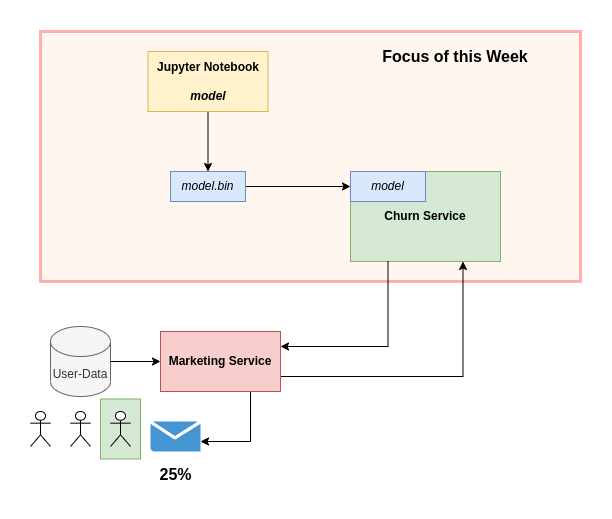
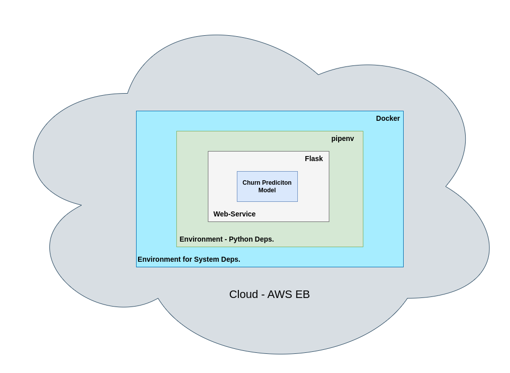
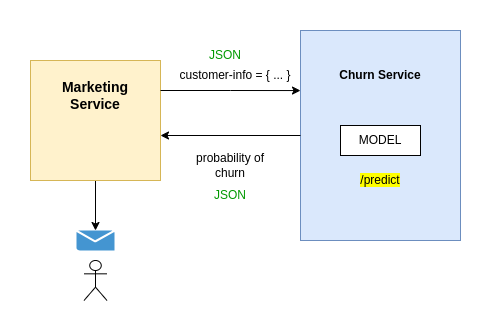

# 5. Deploying Machine Learning Models

- 5.1 [Intro / Session overview](#01-intro)
- 5.2 [Saving and loading the model](#02-pickle)
- 5.3 [Web services: introduction to Flask](#03-flask-intro)
- 5.4 [Serving the churn model with Flask](#04-flask-deployment)
- 5.5 [Python virtual environment: Pipenv](#05-pipenv)
- 5.6 [Environment management: Docker](#06-docker)
- 5.7 [Deployment to the cloud: AWS Elastic Beanstalk (optional)](#07-aws-eb)
- 5.8 [Summary](#08-summary)
- 5.9 [Explore more](#09-explore-more)
- 5.10 [Homework](#homework)

<a id="01-intro"></a>
## 5.1 Intro / Session overview



- Deployment is to use machine learning model inside of an application an make it accessible
- Models are trained and saved
- Users of the machine learning model should be able to send requests to the model and get a prediction in return

### Plan for this Week (General overview)


- Use a trained "churn-prediction" model (from the last weeks) and save it with `pickle`
- Turn the notebook into a Python script (the required parts)
- Put the trained model into a web-service (`Flaks`)
- Isolate all dependencies inside a specific python environment with `pipenv`
- Encapsulating all system dependencies inside a `Docker`-container
- Running the `Docker`-container inside AWS Elastic Beanstalk


<a id="02-pickle"></a>
## 5.2 Saving and loading the model

- Saving the model to `pickle`
- Loading the model from `pickle`
- Turning our notebook into a Python script

```python
import pickle
filanem = "model.bin"

# Saving
with open(filename, "wb") as f_out:
    pickle.dump((dv, model), f_out)

# Loading
with open(filename, "rb") as f_in.
    dv, model = pickle.load(f_in)
```

To export the Notebook as `Python`-file you can call the following command
```bash
jupyter nbconvert --to python notebook.ipynb
```


<a id="03-flask-intro"></a>
## 5.3 Web services: introduction to Flask

- Writing a simple ping/pong app
- Querying it with `curl` and browser

### What is a Web-Service?
- Program that is availbable over the Web
- A user sends a request / query from the local machine and gets a result from the web-service according to the query

### Creating a simple web-service
- Sending a `/ping`-request to the Flask Web-Service
- Receiving `pong`-result from the Flask Web-Service
- The Code can be found in the file [ping.py](./code/ping.py)

```python
# A simple example for a flask web-service
from flask import Flask

app = Flask("ping")

@app.route("/ping", methods=["GET"])
def ping():
    return "PONG"

if __name__ == "__main__":
    app.run(debug=True, host="0.0.0.0", port=9696) 
```

You can access the flask-app by using the browser
```bash
0.0.0.0:9696/ping
```
or by using the `curl` command
```bash
curl 0.0.0.0:9696/ping
``` 
You can choose which `IP`, `Port` and `route` the web-app uses, with the parameters in `app.run(...)`


<a id="04-flask-deployment"></a>
## 5.4 Serving the churn model with Flask

- Wrapping the predict script into a `Flask` app
- Querying it with production: `gunicorn`
- Running it on Windows with `waitress`


- In comparison to the simple `Ping-Pong` flask-app, a more "interactive" flask-app requires `POST` as method of interation. This is because the `GET`-method is only good for obtaining data but not for "posting" data the web-service
    - Directly using the addess `IP:Port/route` is not allowed, since it requires something to be posted. The only way to get outputs from the web-app is to request a result, given an adequate input query.
- Received and sent is in the JSON-format. The web-app recieves the data and parses it, uses it and responds with the results in json format. This can be seen in the following example from the [predict.py](code/predict.py) script.
```python
@app.route("/predict", methods=["POST"])
def predict():
    customer = request.get_json()
    X = dv.transform([customer])
    y_pred = model.predict_proba(X)[0, 1]
    churn = y_pred >= 0.5

    result = {
        "churn_probability": y_pred,
        "churn": churn
    }
    return jsonify(result)
```

- How to query the web-app with a `POST`-request (from notebook: [05-predict-test.ipynb](./code/05-predict-test.ipynb))
```python
import requests

url = "http://localhost:9696/predict"
customer = { ... }
# received the result-json from `predict()`
response = requests.post(url, json=customer).json()

# "The Decision"
if response["churn"] == True:
    print(f"Sending promo-Email to {'xyz-123'}")
```

- **What is this Warning?!**
    - `WARNING: This is a development server. Do not use it in a production deployment. Use a production WSGI server instead.`
- **The Answer!**
    - The direct usage of Flask is intended for application development, but not for deployment in production itself
    - However other production-ready web-services can be used with Flask (e.g. `Gunicorn`, `waitress` (on Windows))
    - Next step is to install `gunicorn` in your Python environment
    ```bash
    pip install gunicorn
    ```

To deploy the flask-based web-app with `Gunicorn` you need to call the following command
- `--bind=ip:port`: specification of ip and port number under which the web-app is being deployed
- `predict`: name of python file with web-app
- `app`: flask-variable inside the python file (here: `app = Flask("churn")`)
```bash
gunicorn --bind=0.0.0.0:9696 predict:app
```

<a id="05-pipenv"></a>
## 5.5 Python virtual environment: Pipenv

- Why we need virtual environments
- Installing `Pipenv`
- Installing libraries with `Pipenv`
- Running things with `Pipenv`

### Why Python Environments are important
- Isolated Python dependencies for specific tasks
- Dependency-file can be created to make python environment reproducible on other devices 

### Installing Python packages with `pip`
`pip` is a python package managment system, that gets it's packages from [pypi.org](https://pypi.org/) (a python package repository)

```bash
# Example install of a package (the latest version)
pip install scikit-learn

# Install of a package with a specific version
pip index versions scikit-learn   # listing available versions
pip install scikit-learn==0.22.1  # a specifc version
```
`pip` determines the installation-path based on the `PATH`-variable. Some examples are here:
- **ml-zoomcamp**: `/home/user/miniconda3/envs/ml-zoomcamp/bin/pip` $\quad\rightarrow\quad$ inside conda environments that conda-sepecific pip-binary will be found first
- **Global packages**: `/usr/bin/pip`

You can find out which `pip` / `python` version is used by using the `which`-command
```bash
# Example for ml-zoomcamp
which python  # /home/user/miniconda3/envs/ml-zoomcamp/bin/python
which pip     # /home/user/miniconda3/envs/ml-zoomcamp/bin/pip
```

### Scenarios of conflicting package versions
- **Situation:** 2 Applciations
    - **Churn-Service** $\quad\rightarrow\quad$ `scikit-learn==0.24.2`
    - **Lead-Scoring-Service** $\quad\rightarrow\quad$ `scikit-learn==1.3.1` (latest)

    - Both applications must be separate, because in the example situation the programs depend on a specific package-version
- **Solution:** creating 2 separate virtual python-environments to avoid version- and dependency-confĺicts

### Different possible tools for virtual environments

- virtualenv:
```bash
# Install `virtualenv`
pip install virtualenv

# Create environment
virtualenv -p python3 virtualenv-name

# Activate environment
source virtualenv-name/bin/activate
```

- venv:
```bash
# No Installation of `venv` required
# Create environment 
python3 -m venv venv-name

# Activate environment
source venv-name/bin/activate
```

- pipenv (used in this course):
```bash
# Install `pipenv`
pip install pipenv

# Creating environment with specified packages (no explicit env.-creation needed)
pipenv install package1 package2 package3

# Installing new packages (must be in same directory as `Pipfile`)
pipenv install package4

# Activate environment (in Pipfile-directory)
pipenv shell
```

### `pipenv` for fhis section + execution of churn-model web-service
```python
# Create pipenv
pipenv install numpy pandas scikit-learn flask gunicorn
# Acticate pipenv-environment
pipenv shell

# Start the web-app with `gunicorn`
gunicorn --bind 0.0.0.0:9696 predict:app

# In another tab call the following to contact the web-app, running in the pipenv
python3 predict-test.py
```

### There is still a problem
- The environments are still not fully separated
- Packages can rely on libraries of the operating system
- One additional layer of separation is required for this -> **Docker**


<a id="06-docker"></a>
## 5.6 Environment management: Docker

- Why we need `Docker`
- Running a Python image with `Docker`
- `Dockerfile`
- Building a `Docker` image
- Running a `Docker` image

<a id="07-aws-eb"></a>
## 5.7 Deployment to the cloud: AWS Elastic Beanstalk (optional)

- Installing the `eb cli`
- Running `eb` locally
- Deploying the model

<a id="08-summary"></a>
## 5.8 Summary

- Save the model with `pickle`
- Use `Flask` to turn the model into a web service
- Use a dependency & env manager
- Package it in `Docker`
- Deploy to the cloud


<a id="09-explore-more"></a>
## 5.9 Explore more

- `Flask` is not the only framework for creating web services. Try others, e.g. `FastAPI`
- Experiment with other ways of managing environment, e.g. `virtualenv`, `conda`, `poetry`
- Explore other ways of deploying web services, e.g. `GCP`, `Azure`, `Heroku`, `Python Anywhere`, etc.

<a id="homework"></a>
## 5.10 Homework
