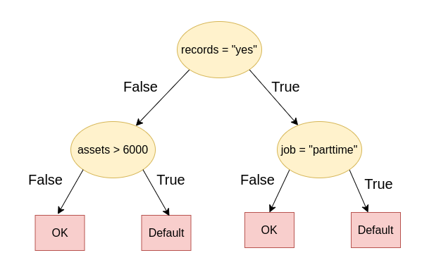
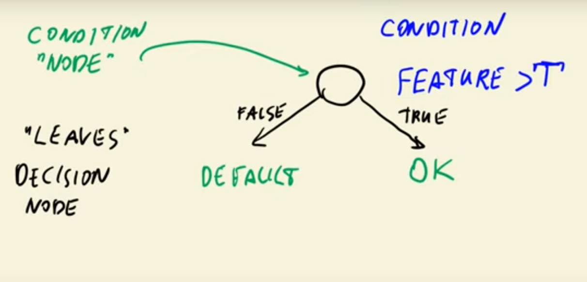

## 6. Decision Trees and Ensemble Learning

- 6.1 [Credit risk scoring project](#01-credit-risk)
- 6.2 [Data cleaning and preparation](#02-data-prep)
- 6.3 [Decision trees](#03-decision-trees)
- 6.4 [Decision tree learning algorithm](#04-decision-tree-learning)
- 6.5 [Decision trees parameter tuning](#05-decision-tree-tuning)
- 6.6 [Ensemble learning and random forest](#06-random-forest)
- 6.7 [Gradient boosting and XGBoost](#07-boosting)
- 6.8 [XGBoost parameter tuning](#08-xgb-tuning)
- 6.9 [Selecting the best model](#09-final-model)
- 6.10 [Summary](#10-summary)
- 6.11 [Explore more](#11-explore-more)
- 6.12 [Homework](#homework)


<a id="01-credit-risk"></a>
## 6.1 Credit risk scoring project

**The real-world problem in this section:** 
- You go to a bank and want to apply for a credit in order to buy an expensive item. 
- You fill in a form with your personal information and some other relevant information 
    - like the price of the item and what amount of money you need
    - do you have a house (or not)
    - how much money do you have
    - what is your income
    - ...

All these factors and possible other ones can be decisive factors (features) for the decision making process of the bank you want to borrow money from. The bank computes a **`credit risk score`** which is used to decide if a customer gets the credit granted or not. This score tells the bank how likely a customer is to not pay back (to default) a given credit.

The mathematical model, that the bank uses can be a machine learning model, that is trained from previous customer data.

### The model
- **Problem-Type**: Classification
- **Model**: $g(X_i) \rightarrow$ probability of default
- **Features**: customer informartion $X_i$
- **Labels**:  $y_i = \{0,1\}$, with $0$ = `OK`, $1$ = `Default`


<a id="02-data-prep"></a>
## 6.2 Data cleaning and preparation

This section is mostly code. The implementation of this step can be seen in this sections notebook [here](./code/section6-notebook.ipynb)


<a id="03-decision-trees"></a>
## 6.3 Decision trees



- A *`Decision Tree`* is a data structure that encodes a series of *if-then-else* rules. In this tree each node represnts a decision / condition that can have a binary result.
- A simple decision tree can be represented as a function with if-then-else, however this is not that easy if the number of the decisions grows
- `scikit-learn` has an implementation for Decision Trees that extracts rules from data automatically
```python
from sklearn.tree import DecisionTreeClassifier
```

For further information of usage please see section 6.3 of this sections notebook [here](./code/section6-notebook.ipynb)

### Training a Decision Tree Classifier
```python
train_dicts = df_train.to_dict(orient="records")
X_train = dv.fit_transform(train_dicts)

dt = DecisionTreeClassifier()
dt.fit(X_train, y_train)
```

### Validating the trained model
```python
val_dicts = df_val.to_dict(orient="records")
X_val = dv.transform(val_dicts)

y_pred = dt.predict_proba(X_val)[:, 1]
roc_auc_score(y_val, y_pred)
```

### Overfitting in Dections Trees
Decision Trees tend to overfit when the data is complex. Decision trees can grow arbitrarilty deep by default and can therefore perfectly fit every datapoint of the training-data perfectly. This will result in perfect AUC-score on the training-data but bad results on every other unseen datapoint. The remedy to this is to limit the depth of the decision tree, s.t. the learning algorithm learns more general condition-statements to generalize better to unseen data.

<a id="04-decision-tree-learning"></a>
## 6.4 Decision tree learning algorithm

### Decision tree learning - How does a DT learn it's rules


- Each decision node learns a partition of data along a certain feature
- A hyperparameter that hast to be found is the threshold-value of every node in the decision tree. The threshold determines the best split of data along a feature

The rest of this subsection can be found int this weeks [notebook](code/section6-notebook.ipynb).

<a id="05-decision-tree-tuning"></a>
## 6.5 Decision trees parameter tuning

See section 6.5 of this weeks [notebook](code/section6-notebook.ipynb).

<a id="06-random-forest"></a>
## 6.6 Ensemble learning and random forest

See section 6.6 of this weeks [notebook](code/section6-notebook.ipynb).


<a id="07-boosting"></a>
## 6.7 Gradient boosting and XGBoost

See section 6.7 of this weeks [notebook](code/section6-notebook.ipynb).


<a id="08-xgb-tuning"></a>
## 6.8 XGBoost parameter tuning

See section 6.8 of this weeks [notebook](code/section6-notebook.ipynb).


<a id="09-final-model"></a>
## 6.9 Selecting the best model

See section 6.9 of this weeks [notebook](code/section6-notebook.ipynb).


<a id="10-summary"></a>
## 6.10 Summary

- Decision tree learn if-then-else rule from data
- Finding the best split: select the least impure split. The algorithm can overfit, that's why we control it by limiting the max depth and the size of the group.
- Random forest is a way of combining multiple decision trees. It should habe a diverse set of models to make good predictions
- Gradient boosting trains model sequentially: each model tries to fix errors of the previous model. XGBoost is an implementation of gradient boosting

<a id="11-explore-more"></a>
## 6.11 Explore more

- For this dataset we didn't do EDA or feature engineering. You can do it to get more insights into the problem.
- For random forest, there are more parameters that we can tune. Check max_features and bootstrap.
- There's a variation of random forest caled "extremely randomized trees", or "extra trees". Instead of selecting the best split among all possible thresholds, it selects a few thresholds randomly and picks the best one among them. Because of that extra trees never overfit. In Scikit-Learn, they are implemented in ExtraTreesClassifier. Try it for this project.
- XGBoost can deal with NAs - we don't have to do fillna for it. Check if not filling NA's help improve performance.
- Experiment with other XGBoost parameters: subsample and colsample_bytree.
- When selecting the best split, decision trees find the most useful features. This information can be used for understanding which features are more important than otheres. See example here for random forest (it's the same for plain decision trees) and for xgboost
- Trees can also be used for solving the regression problems: check DecisionTreeRegressor, RandomForestRegressor and the objective=reg:squarederror parameter for XGBoost.

<a id="homework"></a>
## 6.12 Homework
- Questions can be found [here](homework/homework.md#)
- Solutions can be found [here](homework/solution.ipynb)
