## 8. Neural Networks and Deep Learning


- 8.1 [Fashion classification](#01-fashion-classification)
- 8.1b [Setting up the Environment on Saturn Cloud](#01b-saturn-cloud)
- 8.2 [TensorFlow and Keras](#02-tensorflow-keras)
- 8.3 [Pre-trained convolutional neural networks](#03-pretrained-models)
- 8.4 [Convolutional neural networks](#04-conv-neural-nets)
- 8.5 [Transfer learning](#05-transfer-learning)
- 8.6 [Adjusting the learning rate](#06-learning-rate)
- 8.7 [Checkpointing](#07-checkpointing)
- 8.8 [Adding more layers](#08-more-layers)
- 8.9 [Regularization and dropout](#09-dropout)
- 8.10 [Data augmentation](#10-augmentation)
- 8.11 [Training a larger model](#11-large-model)
- 8.12 [Using the model](#12-using-model)
- 8.13 [Summary](#13-summary)
- 8.14 [Explore more](#14-explore-more)
- 8.15 [Homework](#homework)


<a id="#01-fashion-classification"></a>
## 8.1 Fashion classification

In previous sections we have used tabular data. Tabular data is as the name implies saved in tabular form and therefore easily readable for python-packages like pandas. Tables have already pre-defined features with filled in values for those features. The data used in this section can't be stored in this form, since images are used. Images don't have a unified feature-representation and therefore require a different form of machine learning algorithm than before. 

- **Use-Case:** `Fashion classification service`
    - A user should be able to upload a picture and the machine learning model should return the category of clothing (multi-class)
- **Dataset**: `Clothing dataset (full, high resolution)` from Kaggle
    - Full dataset: https://www.kaggle.com/agrigorev/clothing-dataset-full
    - Subset: https://github.com/alexeygrigorev/clothing-dataset-small 

- This Sections Notebook: [Link](./code/section8-notebook.ipynb)
- More in-depth introduction to Neural Networks: https://cs231n.github.io

<a id="#01b-saturn-cloud"></a>
## 8.1b Setting up the Environment on Saturn Cloud

To run this sections Jupyter Notebook on a GPU you can use Saturn cloud. Please follow [this](https://www.youtube.com/watch?v=WZCjsyV8hZE) Video-Tutorial to set up everything.


<a id="#02-tensorflow-keras"></a>
## 8.2 TensorFlow and Keras

In this section the python Deep Learning Frameworks `TensorFlow` and `Keras` are used.
To in stall TensorFlow and Keras use the following command
```bash
pip install tensorflow

# alternative with cuda-packages (with multiple GB of dependencies)
pip install tensorflow[and-cuda]
```

To use both you simply hava to call the following:
```python
import tensorflow as tf
from tensorflow import keras
```

<a id="#03-pretrained-models"></a>
## 8.3 Pre-trained convolutional neural networks

Both Tensorflow and Keras provide a vast variety of functionality. One important part that is used in this section is the usage of pre-trained models for certain tasks. Keras provides an API for easily loading such models [here](https://keras.io/api/applications/). 

Example usage of pre-trained Tensorflow/Keras model:
```python
from tensorflow.keras.applications.xception import Xception
from tensorflow.keras.applications.xception import preprocess_input
from tensorflow.keras.applications.xception import decode_predictions

img_path = ...
imgs_size = ... # tuple 

# Loading image-data
img = load_img(full_path, target_size=(299, 299)) 
x = np.array(x)  # (H, W, C=3)
X = x[None, ...] # (1, H, W, C=3)

# Load model with weights trained on imagenet
model = Xception(weights="imagenet", input_shape=(299, 299, 3))

# Often models require preprocessing (importante step)
X = preprocess_input(X)
# Running inference on loaded model
pred = model.predict(X)

# Obtaining the 5 top-scores
top_scores = decode_predictions(pred)[0]
print(top_scores)
```

<a id="#04-conv-neural-nets"></a>
## 8.4 Convolutional neural networks (CNNs)

- Special type of neural network that works with images
- Has different layers than a regular neural network 

### Convolution Layers
- Create feature maps from filters (filters as with image processing)
- Learn to detect certain features in an image
- Features are detected by sliding a filter over the input of the layer
- Assign high probability of a feature being present

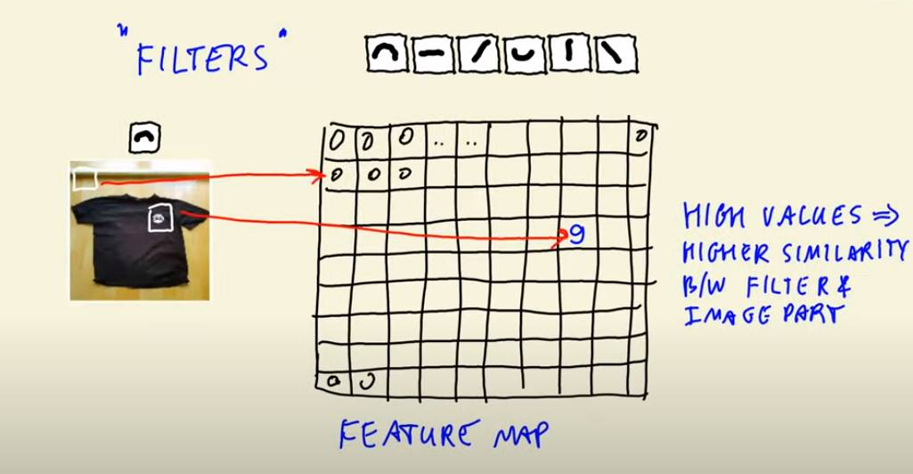

- Each filter creates one feature map, for the feature that is encoded in the filter

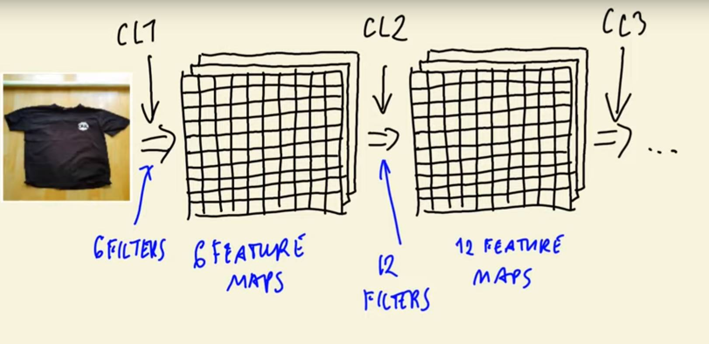

#### How filters in CNNs work
- By chaining multiple convolution-layers the CNN-model learns more complex features. This is becaus the lower-level features of the first layer can be combined to more complex features in deeper layers.
- Filters have to be learned

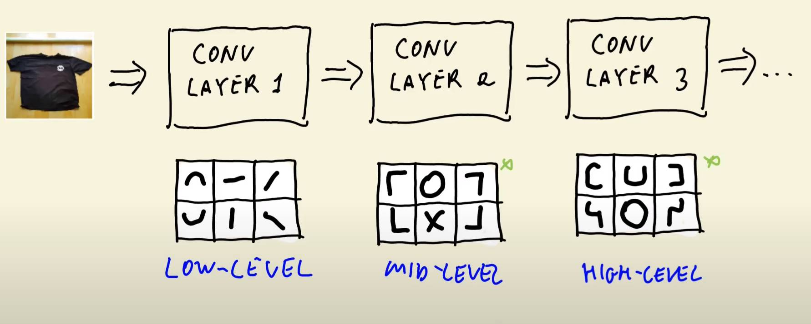

#### Vector-Embedding for prediction
- After passing an image through the CNN you usually get a vectorized representation, that is used for prediction
- Dimensions of the embedded image represent some extracted feature
- Usually lower-dimensional than the image. Example:
    - Image: `(1, 299, 299, 3)`
    - Embedding: `(1, 2048)`
- The image-embedding from the CNN can now be applied to a densly connected neural network. The CNN has the task of learning and extracting relevant features from images for further usage

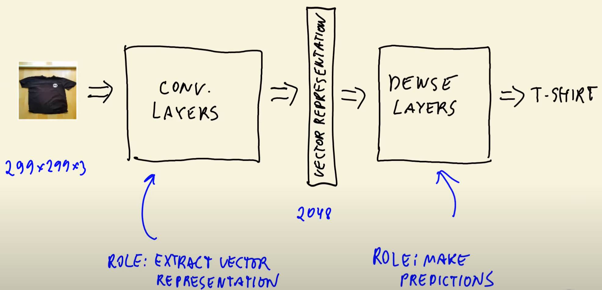

### Pooling Layers (no parameter / not learnable)
- Usually applied after convolution-layer
- Reduce the size of feature maps while retaining most of its information
- Multiple types of pooling operations available:
    - `Max-Pooling`: retains the maximum value seen under pooling filter mask
    - `Average-Pooling`: computes average value under pooling filter mask

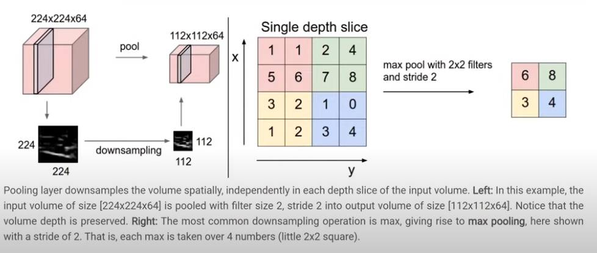

### Dense Layers

- Part that comes after the CNN, that utilizes the extracted image features for certain tasks

#### Building a binary classification model with Logistic Regression using a CNN
- **Task**: Detect if image depicts a T-Shirt
    - `Input`: $x\in\mathbb{R}^{2048}$
    - `Labels`: $y\in\{0=\text{ (no T-shirt)}, 1=\text{ (T-shirt)}\}$
    - `Model`: $g(x) = \text{sigmoid}(x^T w)\rightarrow$ Prob. that $x$ is T-shirt: $p(x=1)$

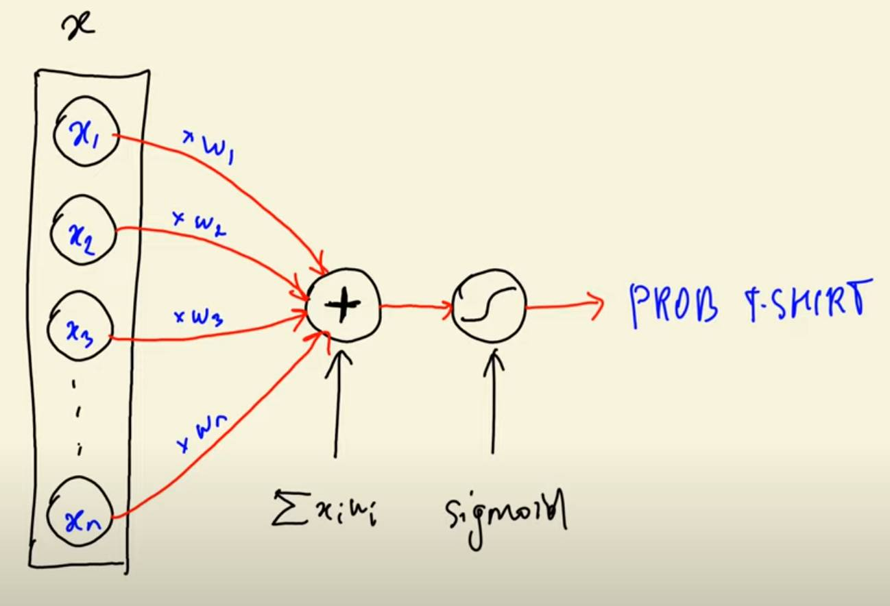

#### Building a multi-class classification model with multiple Logistic Regression using a CNN
- **Task**: Detect if image depicts a T-Shirt, Shirt or Dress
    - `Input`: $x\in\mathbb{R}^{2048}$
    - `Labels`: $y\in\{0=\text{ (Shirt)}, 1=\text{ (T-shirt)}, 2=\text{ (Dress)}\}$
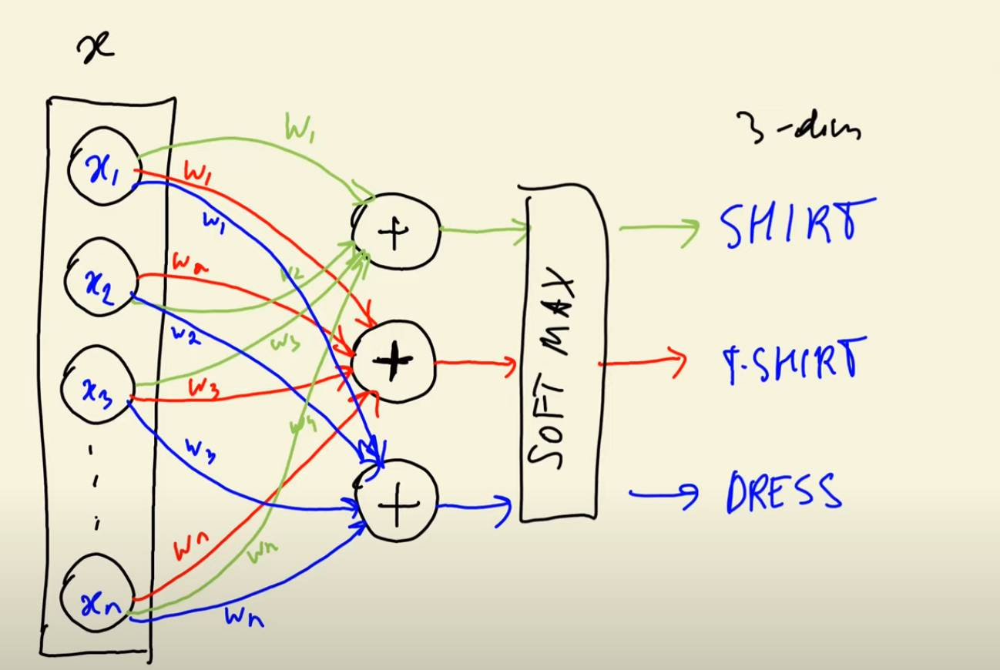
    - `Model`: $g(x) = \text{softmax}(x^Tw)\rightarrow$ Normalized Prob that $x$ is a certain class
        - $g(x)$ is a vector with the size of `nr. of classes`, and $\sum_i g_i(x) = 1$
        - Definition of Softmax: $\text{softmax}(z)_i = \frac{e^{z_i}}{\sum_j e^{z_j}}$

- It is also possible to use dense inner layers to learn "better" features  

#### Overview of the Dense-Layers after a CNN

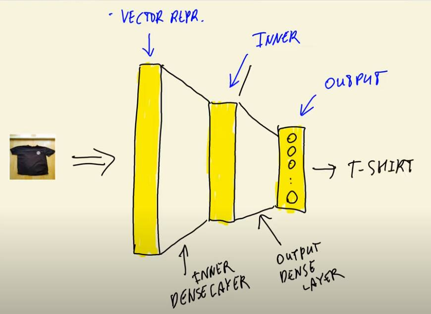

#### The whole model: CNN + Dense

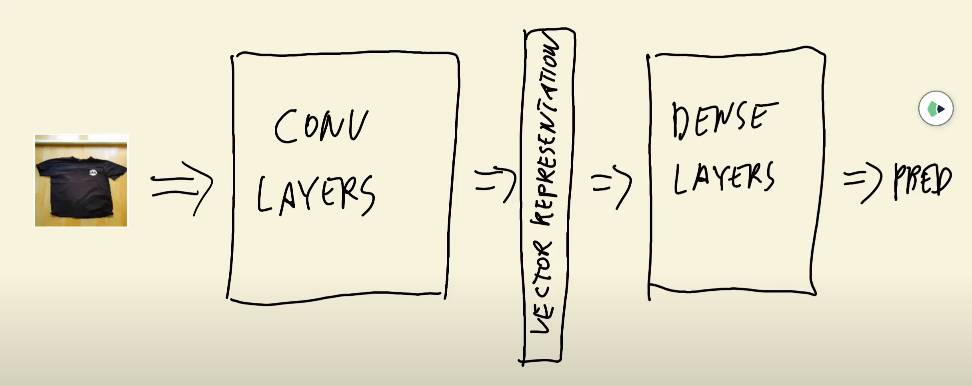


### Wher to find more information
- CS231n: [Convolutional Neural Networks (CNNs / ConvNets)
](https://cs231n.github.io/convolutional-networks/)

<a id="#05-transfer-learning"></a>
## 8.5 Transfer learning

**Main-Idea**:
- Transfering the knowledge of how to extract "good" general features from images to another problem
- The CNN-part of the pre-trained model stays fixed (frozen), but the dense-layers of the model are retrained for the problem at hand

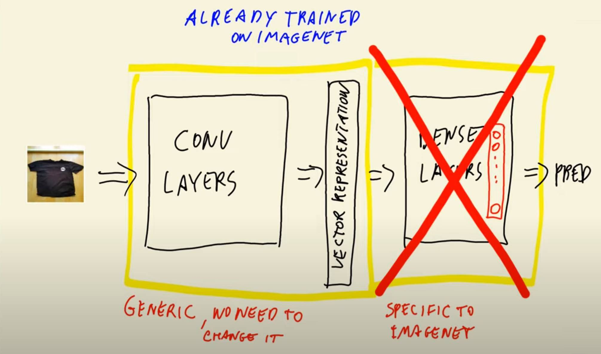

The rest of this sub-section is pretty code-heavy so please refer to `8.5 Transfer learning` of this sections notebook [here](./code/section8-notebook.ipynb)

<a id="#06-learning-rate"></a>
## 8.6 Adjusting the learning rate

### What's the learning rate

As seen in the reults of the last section (see this sections notebook [here](./code/section8-notebook.ipynb)), the validation accuracy will jump around $0.8$. This is caused by a `learning rate` that is too high. An obvious solution to this is to try different learning rates, which is the topic of this section.

The learning rate hyperparameter indicates how big the steps in the training-process of an machine learning algorithm are. Learning rates can be generally subdivided in 3 categrories, of which each has it's pro's and con's:
- **High**: Fast learning process, but the danger of overshooting the location of optimal model-parameters
    - `Example`: 1.0
    - Poor Validation Accuracy + Overfitting 
- **Small**: Does not overshoot local/global optima of model-parameters, but is very slow
    - `Example`: 0.001
    - Poor Validation Accuracy + Underfitting
- **Medium**: Generally a good tradeoff between 
    - `Example`: 0.1

*Inportant*: Finding the right learning rate is a part of hyperparameter-tuning of Neural Networks.

Further parts of this section can be found in Section 8.6 of this weeks notebook [here](./code/section8-notebook.ipynb)

### Trying different values
After evaluating the learned model in the notebook we obtain the following graph for the validation-accuracy:
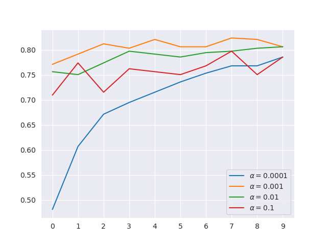

From the graph one can see, that the learning rate of $\alpha=0.001$ works best when here. The validation-accuracy is above the ones of all other tried learning rates.

You can see, that the difference is smaller when comparing training and validation accuracy, which indicates a stronger generalization ability of the model.


<a id="#07-checkpointing"></a>
## 8.7 Checkpointing

- The process of saving model parameters during training
- Tensorflow/Keras provides functionality for this with `callbacks`

### Example of use
```python
#### Manual Version ####

# Saving a model with a simple function-call manually
model.save_weights("model_v1.h5", save_format="h5")


#### Callback Version ####

# Checkpoint-Saving callback that can be given as parameter in `keras.fit()`
# -> Saving conditions can be configured as seen in the callback below
ckpt_callback = keras.callbacks.ModelCheckpoint(
    "model_v1_{epoch:02d}_{val_accuracy:.3f}.h5".format(epoch, val_accuracy),
    save_best_only=True,    # only saves when model / monitored metric improves
    monitor="val_accuracy", # metric to monitor
    mode="max"              # what should be done with metric
)

# How to use the callback 
history = model.fit(
    train_ds, 
    epochs=10, 
    validation_data=val_ds,
    callbacks=[checkpoint]
)
```

For working code using those functions please look into Section 8.7 in this weeks notebook [here](./code/section8-notebook.ipynb)

<a id="#08-more-layers"></a>
## 8.8 Adding more layers

- One layer only has a limited capability to learn complex feaures and is therefore limited in its capability.

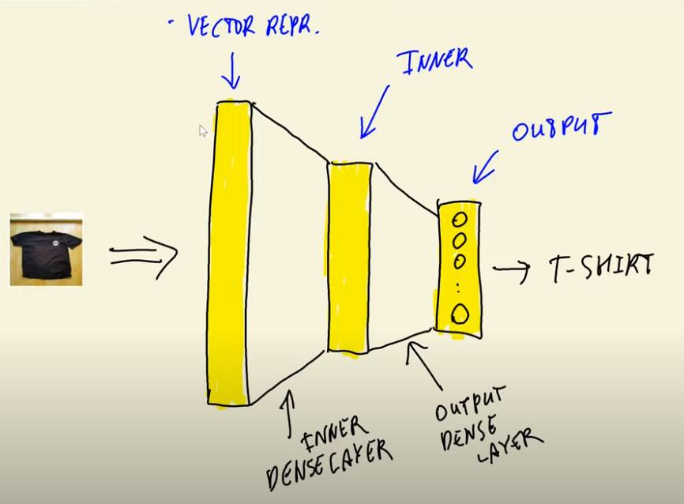

- The new version of the neural network now looks like this:

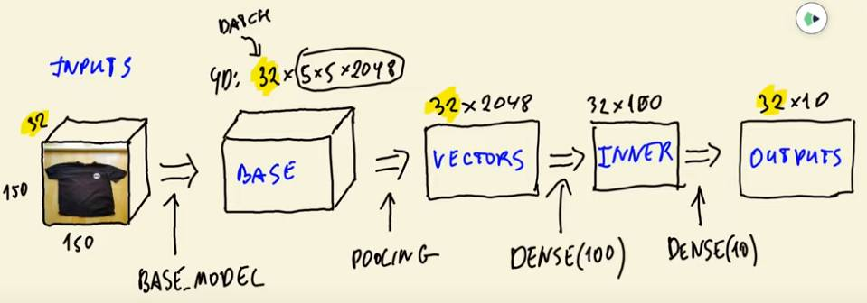

**`Activation Functions`**:

Usually applied after each layer, in order to achieve better performance. This is caused by the transformation from linear function to non-linear function. With this the Neural Network has greater approximation power to complex problems.


**Output-Activations**
- `Sigmoid`: Binary $\quad\sigma(z) = \frac{1}{1 + e^{-z}}$
- `Softmax`: Multiclass $\quad\text{softmax}(z)_i = \frac{e^{z_i}}{\sum_j e^{z_j}}$

**Intermediate-Activations**
- `ReLU`: Linear in positive real numbers, otherwise 0
- `...`: many other

For applying extra layers with activation functions, please go to Section 8 of this weeks notebook [here](code/section8-notebook.ipynb)

<a id="#09-dropout"></a>
## 8.9 Regularization and dropout


<a id="#10-augmentation"></a>
## 8.10 Data augmentation


<a id="#11-large-model"></a>
## 8.11 Training a larger model


<a id="#12-using-model"></a>
## 8.12 Using the model


<a id="#13-summary"></a>
## 8.13 Summary


<a id="#14-explore-more"></a>
## 8.14 Explore more


<a id="#homework"></a>
## 8.15 Homework