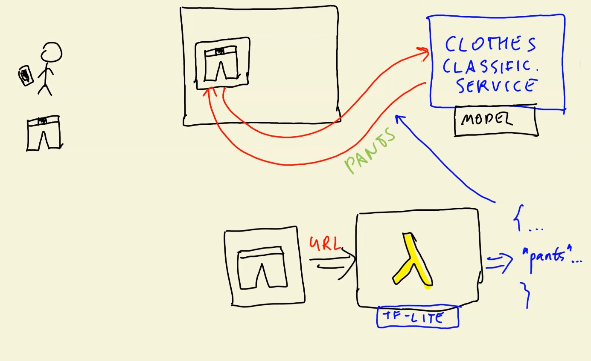

## 9. Serverless Deep Learning

- 9.1 [Introduction to Serverless](#01-intro)
- 9.2 [AWS Lambda](#02-aws-lambda)
- 9.3 [TensorFlow Lite](#03-tensorflow-lite)
- 9.4 [Preparing the code for Lambda](#04-preparing-code)
- 9.5 [Preparing a Docker image](#05-docker-image)
- 9.6 [Creating the lambda function](#06-creating-lambda)
- 9.7 [API Gateway: exposing the lambda function](#07-api-gateway)
- 9.8 [Summary](#08-summary)
- 9.9 [Explore more](#09-explore-more)
- 9.10 [Homework](#homework)


<a id="01-intro"></a>
## 9.1 Introduction to Serverless

- This week, the deep learning model from last week (`fashion classification`) should be de deployed
- The deployed model should take an image URL as input and output its clothing-category
- `AWS Lambda` is used, since it allows to deploy many things (including machine learning models)
    - This services is queried with an valid input (image-URL) and the service returns class-scores of the machine learning model
- `AWS Lambda` will use `Tensorflow-Lite` for the application



The different components mentioned here will be explained in subsequent chapters of this section.

<a id="02-aws-lambda"></a>
## 9.2 AWS Lambda

- Intro to AWS Lambda
- Serverless vs Serverfull

### What is AWS Lambda?
- Webservice provided by AWS
- Only costs money / is billed when used
- Serverless does not mean "without a server", but rather that you don't need to think about creating EC2-instances etc. because AWS takes care of everything. This type of services is classified as Function-as-a-Service (FaaS).

Further steps are done on the AWS-Website
1. Navigate to AWS Lambda
2. Click `Create Function`
3. Create a Funtion with:
    - **Function name**: `mlzoomcamp-test`
    - **Runtime**: `Python 3.9`
    - **Architecture**: `x86_64`

After the AWS Lambda function is created you can scroll down and see the an editor with the header **`Code source`**

 

For testing purposes the code has to be changed to this:
```python
import json

def lambda_handler(event, context):
    print("parameters: ", event)
    return "PONG"
```
Now the `Test`-Button of the `Code source` editor to create a new test-event for the implemented function. The results will not conform with the new code. This is because the new code is not yet deployed and can be remedied by clicking the `Deploy`-button.

The next step is to change the code again to make it more resemble the desired code. For this the source code has to be changed and a new test has to be created

**The Code**
```python
import json

def lambda_handler(event, context):
    print("parameters: ", event)
    url = event["url"]
    results = predict(url)

    return results
```

**The Test**
```json
{
  "url": "some-url-of-pants"
}
```

<a id="03-tensorflow-lite"></a>
## 9.3 TensorFlow Lite

- Why not TensorFlow?
- Converting the model
- Using the TF-Lite model for making predictions

### Why not TensorFlow Lite?
- Lighter version (~1MB) of regular TensorFlow (1.7GB) 
- AWS Lambda earlier did not allow files under 50 MB, but now allows up to 75 GB ([Link](https://docs.aws.amazon.com/lambda/latest/dg/gettingstarted-limits.html))
- Higher storage cost
- Slow to import & takes longer to initialize TensorFlow 
- Bigger RAM footprint

#### The main difference between TensorFlow and TF-Lite
- `TensorFlow`: Can do training and inference
- `TF-Lite`: Can only do inference and convert model to `TF-Lite`-format


### Converting the model
- Converts TensorFlow-Core model to smaller and optmized TF-Lite model

This part of the section has some code examples that can be found in the accompanying notebook [here](code/tensorflow-model.ipynb).

<a id="04-preparing-code"></a>
## 9.4 Preparing the code for Lambda

- Moving the code from notebook to script
- Testing it locally


<a id="05-docker-image"></a>
## 9.5 Preparing a Docker image

- Lambda base image
- Preparing the dockerfile
- Using the right TF-Lite wheel


<a id="06-creating-lambda"></a>
## 9.6 Creating the lambda function

- Publishing the image to AWS ECR
- Creating the function
- Configuring it
- Testing the function from the AWS Console
- Pricing


<a id="07-api-gateway"></a>
## 9.7 API Gateway: exposing the lambda function

 - Creating and configuring the gateway


<a id="08-summary"></a>
## 9.8 Summary

<a id="09-explore-more"></a>
## 9.9 Explore more

<a id="homework"></a>
## 9.10 Homework

