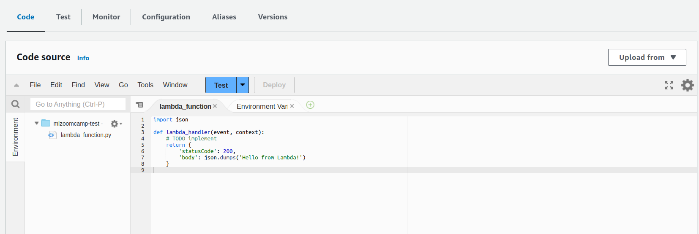

## 9. Serverless Deep Learning

- 9.1 [Introduction to Serverless](#01-intro)
- 9.2 [AWS Lambda](#02-aws-lambda)
- 9.3 [TensorFlow Lite](#03-tensorflow-lite)
- 9.4 [Preparing the code for Lambda](#04-preparing-code)
- 9.5 [Preparing a Docker image](#05-docker-image)
- 9.6 [Creating the lambda function](#06-creating-lambda)
- 9.7 [API Gateway: exposing the lambda function](#07-api-gateway)
- 9.8 [Summary](#08-summary)
- 9.9 [Explore more](#09-explore-more)
- 9.10 [Homework](#homework)


<a id="01-intro"></a>
## 9.1 Introduction to Serverless

- This week, the deep learning model from last week (`fashion classification`) should be de deployed
- The deployed model should take an image URL as input and output its clothing-category
- `AWS Lambda` is used, since it allows to deploy many things (including machine learning models)
    - This services is queried with an valid input (image-URL) and the service returns class-scores of the machine learning model
- `AWS Lambda` will use `Tensorflow-Lite` for the application


The different components mentioned here will be explained in subsequent chapters of this section.

<a id="02-aws-lambda"></a>
## 9.2 AWS Lambda

- Intro to AWS Lambda
- Serverless vs Serverfull

### What is AWS Lambda?
- Webservice provided by AWS
- Only costs money / is billed when used
- Serverless does not mean "without a server", but rather that you don't need to think about creating EC2-instances etc. because AWS takes care of everything. This type of services is classified as Function-as-a-Service (FaaS).

Further steps are done on the AWS-Website
1. Navigate to AWS Lambda
2. Click `Create Function`
3. Create a Funtion with:
    - **Function name**: `mlzoomcamp-test`
    - **Runtime**: `Python 3.9`
    - **Architecture**: `x86_64`

After the AWS Lambda function is created you can scroll down and see the an editor with the header **`Code source`**

 

For testing purposes the code has to be changed to this:
```python
import json

def lambda_handler(event, context):
    print("parameters: ", event)
    return "PONG"
```
Now the `Test`-Button of the `Code source` editor to create a new test-event for the implemented function. The results will not conform with the new code. This is because the new code is not yet deployed and can be remedied by clicking the `Deploy`-button.

The next step is to change the code again to make it more resemble the desired code. For this the source code has to be changed and a new test has to be created

**The Code**
```python
import json

def lambda_handler(event, context):
    print("parameters: ", event)
    url = event["url"]
    results = predict(url)

    return results
```

**The Test**
```json
{
  "url": "some-url-of-pants"
}
```

<a id="03-tensorflow-lite"></a>
## 9.3 TensorFlow Lite

- Why not TensorFlow?
- Converting the model
- Using the TF-Lite model for making predictions

### Why not TensorFlow Lite?
- Lighter version (~1MB) of regular TensorFlow (1.7GB) 
- AWS Lambda earlier did not allow files under 50 MB, but now allows up to 75 GB ([Link](https://docs.aws.amazon.com/lambda/latest/dg/gettingstarted-limits.html))
- Higher storage cost
- Slow to import & takes longer to initialize TensorFlow 
- Bigger RAM footprint

#### The main difference between TensorFlow and TF-Lite
- `TensorFlow`: Can do training and inference
- `TF-Lite`: Can only do inference and convert model to `TF-Lite`-format


### Converting the model
- Converts TensorFlow-Core model to smaller and optmized TF-Lite model

This part of the section has some code examples that can be found in the accompanying notebook [here](code/tensorflow-model.ipynb).

<a id="04-preparing-code"></a>
## 9.4 Preparing the code for Lambda

- Moving the code from notebook to script
- Testing it locally

### Extracting the code from the notebook of subsection 9.3
To do this you have to use the following command:
```bash
# Generating tensorflow-model.py
jupyter nbconvert --to script tensorflow-model.ipynb
```

The last section of the notebook is the relevant code and will remain in the script ([lambda_function.py](code/lambda_function.py)) :
```python
#!/usr/bin/env python
# coding: utf-8
# Filename: lambda_function.py

import tflite_runtime.interpreter as tflite
from keras_image_helper import create_preprocessor

# TF-Less preprocessing
preprocessor = create_preprocessor("xception", target_size=(299, 299))

# Load TF-Lite model and get input-/output-indices for the model
interpreter = tflite.Interpreter(model_path="clothing_model.tflite")
interpreter.allocate_tensors()

input_index = interpreter.get_input_details()[0]["index"]
output_index = interpreter.get_output_details()[0]["index"]

# Loading the data
# url = "http://bit.ly/mlbookcamp-pants"

classes = [
    "dress",
    "hat",
    "longsleeve",
    "outwear",
    "pants",
    "shirt",
    "shoes",
    "shorts",
    "skirt",
    "t-shirt"
]

def predict(url):
    X = preprocessor.from_url(url)
    # Running the inference / doing prediction
    interpreter.set_tensor(input_index, X)
    interpreter.invoke()
    preds = interpreter.get_tensor(output_index)

    return dict(zip(classes, preds[0]))


def lambda_handler(event, context):
    url = event["url"]
    result = predict(url)
    return result
```

To test if it is working, you can use the ipython-console use the following code:
```python
>> import lambda_function
>> event = { "url": "http://bit.ly/mlbookcamp-pants" }
>> lambda_function.lambda_handler(event=evnet, context=None)
```

The code will not used on AWS Lambda in this form yet. It will be packaged into docker, where all dependencies live, and is then deployed.

<a id="05-docker-image"></a>
## 9.5 Preparing a Docker image

- Lambda base image
- Preparing the dockerfile
- Using the right TF-Lite wheel

### Obtaining the base image for AWS Lambda and customizing
- Go to the AWS-page for Lambda Docker-Images [here](https://gallery.ecr.aws/lambda/python).
- Find Python 3.8 image and paste it into an empty [Dockerfile](code/Dockerfile) (`public.ecr.aws/lambda/python:3.8`)

```Dockerfile
FROM public.ecr.aws/lambda/python:3.8

RUN pip install -U pip
RUN pip install keras-image-helper
# Adrquate runtime version without having to compile it
RUN pip install https://github.com/alexeygrigorev/tflite-aws-lambda/raw/main/tflite/tflite_runtime-2.7.0-cp38-cp38-linux_x86_64.whl 

COPY ["clothing_model.tflite", "lambda_function.py", "./"]

CMD [ "lambda_function.lambda_handler" ]
```

Now that the dockerfile is done, it can be tested with the following [script](code/test.py):
```python
import requests

url = 'http://localhost:8080/2015-03-31/functions/function/invocations'
data = {'url': 'http://bit.ly/mlbookcamp-pants'}
result = requests.post(url, json=data).json()
print(result)
```
There is still some error left. This is because numpy-arrays can't be JSON-serialized and have to be converted to python-floats. Therefore the following change in [lambda_function](code/lambda_function.py) has to been made:

```python
...
# Changes to predict-function
def predict(url):
    X = preprocessor.from_url(url)
    # Running the inference / doing prediction
    interpreter.set_tensor(input_index, X)
    interpreter.invoke()
    preds = interpreter.get_tensor(output_index)
    float_preds = preds[0].tolist() # float np.ndarray -> float list

    return dict(zip(classes, float_preds))
...
```

The `predict()`-function in `lambda_function` will now work 
```bash
>> python test.py
{'dress': -1.8798636198043823, 'hat': -4.756308555603027, 'longsleeve': -2.359534740447998, 'outwear': -1.089263916015625, 'pants': 9.903780937194824, 'shirt': -2.826178550720215, 'shoes': -3.648308277130127, 'shorts': 3.24115252494812, 'skirt': -2.612095594406128, 't-shirt': -4.852035045623779}
```

The next step is deploying the created docker image to AWS-Lambda.

<a id="06-creating-lambda"></a>
## 9.6 Creating the lambda function

- Publishing the image to AWS ECR
- Creating the function
- Configuring it
- Testing the function from the AWS Console
- Pricing

### Deploying the container image to AWS
Go to the AWS-Lambda section and create a function
- Choose `Container image` as function type
- Then choose an arbitrary `Function name`
- This step requires an `Amazon ECR Image URI` (we don't have that yet!)

How to get a `Amazon ECR Image URI` for your custom docker container
- Open another tab and search for ECR (Elastic Container Registry)
- Use the Web-UI or `awscli` (command line tool for AWS) to create a container registry (Here: `aswcli` used)

```bash
# If not already installed
pip install awscli
```

```bash
# Create repository with a specified name
aws ecr create-repository --repository-name clothing-tflite-images
```

If everything worked, the command will result in something like this:
```json
{
    "repository": {
        "repositoryArn": "arn:aws:ecr:<region>:<registryId>:repository/clothing-tflite",
        "registryId": "<registryId>",
        "repositoryName": "clothing-tflite",
        "repositoryUri": "<registryId>.dkr.ecr.<region>.amazonaws.com/clothing-tflite",
        "createdAt": "<create-time>",
        "imageTagMutability": "MUTABLE",
        "imageScanningConfiguration": {
            "scanOnPush": false
        },
        "encryptionConfiguration": {
            "encryptionType": "AES256"
        }
    }
}
```
The information about the created registry, after it's creation, can be obtained from here:
```sh
aws ecr describe-repositories --registry-id <registryId> --repository-names <repositoryName>
```


The created registry (ECR) can now be used to publish docker images to. To do this you have to log-in to ECR, which can be done with:
```
$(aws ecr get-login --no-include-email)
```

To finally push the existing docker image, a specific URI has to be set, to which it is pushed to:
```sh
ACCOUNT=<registryId>
REGION=<region>
REGISTRY=clothing-tflite-images
PREFIX=${ACCOUNT}.dkr.ecr.${REGION}.amazonaws.com/${REGISTRY}

TAG=clothing-model-xception-v4-001
REMOTE_URI=${PREFIX}:${TAG}
```
You heve now the full ECR-URI (`echo $REMOTE_URI`) to use for AWS-Lambda.

To finally push the docker image to ECR you have to tag the docker image with the ECR-URI and then push it:
```sh
docker tag clothing-model:latest ${REMOTE_URI}
docker push ${REMOTE_URI}  # Will take some time (depending on internet connection)
```

Now you can find your pushed docker image in the `clothing-tflie-images`-repository on the AWS-Website. After all this, you are able to use the docker image in the `clothing-prediction` Lmabda-function.

### Continuing the creation process for the Lambda-Function

1. Select `Container image`
2. Chose adequate name like `clothing-classification`
3. Copy & Paste the `REMOTE_URI` to `Container image URI`-field or browse & choose from the registry
4. No other changes to the default parameters have to be made.

<u>Drawback of Docker-based Functions</u>: No Code preview!

### Testing the AWS-Lambda function
Create a new test for the function with the following content:
```json
{
    "url": "http://bit.ly/mlbookcamp-pants"
}
```
- This will result in an error, because the function did not return a result in under *3 Seconds* (default for Lambda-functions).
- **Remedy**: Go to `Configuration`-tab and 
    - increase the `Timeout`-parameter to *30 Seconds*
    - increase the `Memory`-parameter to *1024 MB* (*1GB*)


**Now**: Test succeeds!


The first execution will take ~7 Seconds, but subsequent executions will be faster.
```sh
# First Execution (Billed Duration: 17504 ms ~= 17 s)
REPORT RequestId: <requestID>	Duration: 14317.36 ms	Billed Duration: 17504 ms	Memory Size: 1024 MB	Max Memory Used: 266 MB	Init Duration: 3186.55 ms

# Second Execution (Billed Duration: 2124 ms ~= 2 s)
REPORT RequestId: <requestID>	Duration: 2123.74 ms	Billed Duration: 2124 ms	Memory Size: 1024 MB	Max Memory Used: 269 MB	
```

### Billing
To find out what the of running a Lambda-function is, please check out the following link [here](https://aws.amazon.com/lambda/pricing/).
- Select the AWS-Region and choose `x86 Price`
- Look up `Price per ms` for `Memory (MB)` being 1024

```python
# Code for estimating the usage-price of the Lambda-function

gb_price = 0.0000000167 # Price for 1024 MB
test_time_ms = 2000     # examplary value of ms

n_images = [1, 10_000, 1_000_000]

for n in n_images:
    exec_price = gb_price * test_time_ms * n
    print(f"billed: ${exec_price:f} for {n} images")

# Results:
#   billed: $0.000033 for 1 images
#   billed: $0.334000 for 10000 images
#   billed: $33.400000 for 1000000 images
```

The AWS-Lambda function is now up and running, however it cant yet be used as a Web-Service. For this you have to "expose" the Lambda-Function as a Web-Service. This will be handled in the next subsection.


<a id="07-api-gateway"></a>
## 9.7 API Gateway: exposing the lambda function

 - Creating and configuring the gateway

### API-Gateway
- AWS-Service that allows to "expose" other AWS-Services as Web-Sevices

#### Creating an API-Gateway
- Go to `API-Gateway`-Service and choose `REST API` as API type
- Choose `New API` and name it `clothes-classification`, then click `Create API`
- In the `Resources`-window click `Create resource` and name it `predict`
- Click `Create Method`
    - Set the **method** to `POST`
    - Set **Integration type** to `Lambda-Function`
    - Set **Lambda function** to `clothing-classification`

Now you can query the API with an example for testing:


Now that you can see, that the REST-API works as intended, it is time to expose it!
- Click on the yellow `Deploy API` button, choose `*New stage*` and name it `test`
- Click `Deploy` and you will get an URL, that can be used for sending POST-requests to

This REST-API Gateway is now "exposen" and has the previously defined Lambda-Funcation running in the background
```sh
# Form of API-Link
https://<API_NUMBER>.execute-api.<AWS_REGION>.amazonaws.com/test
```

### New version of the test-script

- [test.py](code/test.py) adapted for contacting the configured AWS REST-API
- <u>To avoid unwanted access</u>: `AWS_REGION` and `API_NUMBER` can be extracted from the provided link and have to be set beforehand
- Fallback to local deployment when environment variables not set properly

```python
import os
import requests

try:
    ## AWS Lambda-Function over API-Gateway
    AWS_REGION = os.environ["AWS_REGION"]
    API_NUMBER = os.environ["API_NUMBER"]
    url = f"https://{API_NUMBER}.execute-api.{AWS_REGION}.amazonaws.com/test/predict"
except:
    # Local Function (requires docker container running)
    url = 'http://localhost:8080/2015-03-31/functions/function/invocations'

data = {'url': 'http://bit.ly/mlbookcamp-pants'}
 
result = requests.post(url, json=data).json()
print(result)
```
**Response from the API-Request:**
```json
{'dress': -1.8798636198043823, 'hat': -4.756308555603027, 'longsleeve': -2.359534740447998, 'outwear': -1.089263916015625, 'pants': 9.903780937194824, 'shirt': -2.826178550720215, 'shoes': -3.648308277130127, 'shorts': 3.24115252494812, 'skirt': -2.612095594406128, 't-shirt': -4.852035045623779}
```


<a id="08-summary"></a>
## 9.8 Summary

- `AWS Lambda` is way of deploying models without having to worry about services $\rightarrow$ Function-as-a-Service (FaaS)
    - Useful for low-volume requests
- `TensorFlow Lite` is a lightweight alternative to `TensorFlow` that only focuses on inference
- To deploy your code, package it in a Docker container
- Expose the lambda function via `API-Gateway`

<a id="09-explore-more"></a>
## 9.9 Explore more
- There are other ways than `AWS Lambda` to deploy models in a so called `Serverless fashion`
    - **Google Cloud**: Google Cloud Functions ([Link](https://cloud.google.com/functions))
    - **Microsoft Azure**: Azure Functions ([Link](https://azure.microsoft.com/en-us/products/functions/))

<a id="homework"></a>
## 9.10 Homework
- The homework tasks can be found [here](homework/homework.md)
- The homework solutions can be found [here](homework/solutions.ipynb)