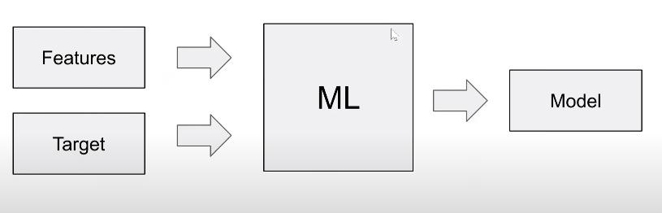
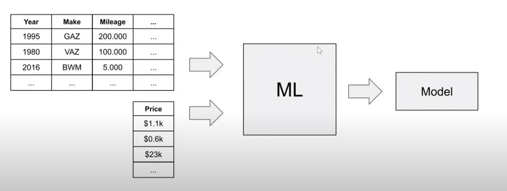
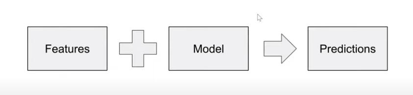
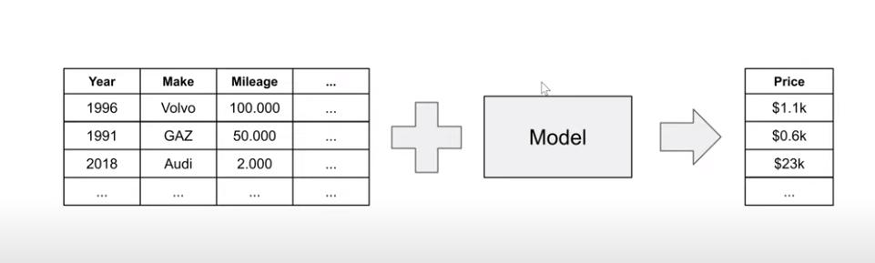
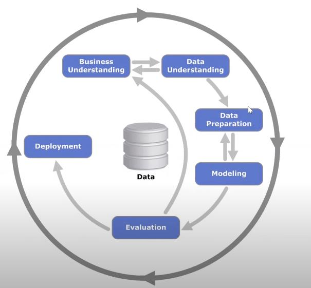
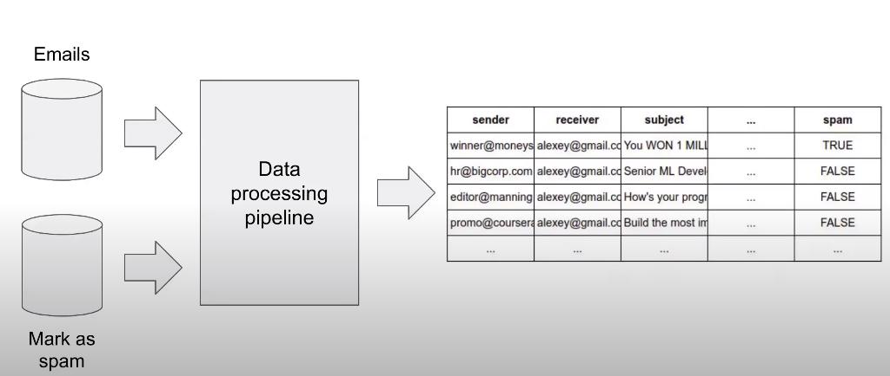

# 1. Introduction to Machine Learning


- 1.1 [Introduction to Machine Learning](#01-what-is-ml)
- 1.2 [ML vs Rule-Based Systems](#02-ml-vs-rules)
- 1.3 [Supervised Machine Learning](#03-supervised-ml)
- 1.4 [CRISP-DM](#04-crisp-dm)
- 1.5 [Model Selection Process](#05-model-selection)
- 1.6 [Setting up the Environment](#06-environment)
- 1.7 [Introduction to NumPy](#07-numpy)
- 1.8 [Linear Algebra Refresher](#08-linear-algebra)
- 1.9 [Introduction to Pandas](#09-pandas)
- 1.10 [Summary](#10-summary)
- 1.11 [Homework](#homework)

<a id="01-what-is-ml"></a>
## 1.1 Introduction to Machine Learning

### Problem: You want to sell a car, but dont knwo the usual sale-price
- **Use Machine Learning (ML)**
    - Use different properties of the car as features, like for example the year of production (`Year`), the car maker (`Make`), the milage (`Milage`) and so on.
    - You also have the price as label / target for the previously sold cars
    - You use the features and the price-label as data for a ML-Algorithm
- **ML-Models**
    - Algorithms that learns to detect patterns from data
    - *Example:* If a car is old, it is usually less expensive than a new car.



- **Training**
    - A usable Model is obtained by training it with features of the specific domain (here: car-sale price prediction) and the (price-)target data
    - Mathematically data is often represented as $X$ and the target data as $y$


- **Inference / Using the Model for Prediction**


    - New datapoints are given to the model to predict the price of unseen datapoints
    


<a id="02-ml-vs-rules"></a>
## 1.2 ML vs Rule-Based Systems

### What are Rule-Based Systems (RBS)
- System that does predictions based on pre-defined rules
- Rules based on expert knowledge of the specified domain

- <u>**Pro's:**</u>    
    - **Accuracy**: Only works inside the bounds of given domain-knowledge and therefore only uses known cause and effect relations.
    - **Ease of use**: Only requires small amoounts
- <u>**Con's:**</u>
    - **Limited Scope**: No learning capabilities
    - **Scalability properties**: using more rules can introduce increasing complexity

### Example for a Rule-Based System: Spam-Detection

- **SPAM:** Unsolicited mails that promote something or try to scam people
- We want to avoid such mails, and therefore build a SPAM-Detection Classifier
    - 1st Idea: obtain some patterns from the mails, that are seen in spam-mails and encode them as rules
    - Examplary rule-set for spam-detection:
        - `If sender = promotions@online.com then "spam"`
        - `If title contains "tax review" and sender_domain is "online.com" then "spam"`
        - `Otherwies "good email"`

        ```python
        # Python code for the exemplary rule-set
        def detect_spam(email):
            if email.sender == "promo@online.com":
                return SPAM
            if contains(email.title, ["tax", "review"]) and 
                    domain(email.sender, "online.com"):
                return SPAM
            return GOOD
        ```
- **Problem:** You can get in "trouble" a totally legit email is classified as spam. To remedy this problem you have to add more rules and repeat this, if a problem like this arises again.
    - The remedy of the problem itself becomes a problem over time
    - Too much rules make the model slow and very complex
- **Solution:** Use Machine Learning!

### Machine Learning
- <u>**The general process of ML**</u>
    - Get Data
    - Define and calculate features
    - Train and use the model

#### SPAM-Classification Example with ML
- **Getting Data**: Let user classify mails as spam e.g. with a button that can be clicked
    - The Data: Email and SPAM-class label (SPAM or GOOD)
- **Define and calculate Features**
    - Start with the "Rules" and use the rules as features
    - Example here: 6 binary features
    ``` 
    Length of title > 10 ? true : false
    Length of body  > 10 ? true : false      
    Sender "proposition@online.com" ? true : false
    Sender "hpYOSKmL@test.com" ? true : false
    Sender domain "test.com" ? true : false
    Description contains "deposit" ? true : false
    ```
    
    - Binary encoding of the rule-results: `0` -> False, `1` -> True
    - The mail here is classified as spam, this means that the label is `1`
    - Example for a set of multiple emails:
    ``` python
    #    Features          Target
    #     (data)       (desired output)
    [1, 1, 0, 0, 1, 1]       1
    [0, 0, 0, 1, 0, 1]       0
    [1, 1, 1, 0, 1, 0]       1
    [1, 0, 0, 0, 0, 1]       1
    [0, 0, 0, 1, 1, 0]       1
    ```

- **Train and use the Model**
    - Use the `data` and the `target` as training data to train the model
    - Usually numeric encodings of features are used (like in the example above)
    - After training, the model can be used for prediction
    ``` python
    #    Features        Predictions     Final outcome
    #     (data)           (output)        (decision)
    [1, 1, 0, 0, 1, 1]        0.8              1 (SPAM)
    [0, 0, 0, 1, 0, 1]        0.6              1 (SPAM)
    [1, 1, 1, 0, 1, 0]        0.1              0 (GOOD)
    [1, 0, 0, 0, 0, 1]        0.01             0 (GOOD)
    [0, 0, 0, 1, 1, 0]        0.4              0 (GOOD)
    ```
    - "Decision-boundary" here can be that predictions that are above the threshold of probability of $prediction \ge 0.5$ are classified as `SPAM = 1`

### Summary

- **Rule-Based System**
    - You have code with hard-coded rules and data, that are used to predict predefined outcomes
    - `Inputs`: Data, Coda
    - `Outputs`: Outcome (Label)
- **ML-Based Systems**
    - ML uses the data and the outcomes to "learn the rules". The output of ML-process is a ML-Model that encodes the decisions that were encoded in the inputs.
    - ML-Models can generalize better
    - `Input`: Data, Outcomes (Label)
    - `Outputs`: Model

<a id="03-supervised-ml"></a>
## 1.3 Supervised Machine Learning

### Examples for Supervised Learning (SL)
- Car-price prediction
- SPAM prediction

### Explanation
- The data $X$ and the labels $y$
    - $X$ is usually called `feature (matrix)`
    - $y$ is usually called `label` or `target`

### Notation
$$g(X) \approx y$$
- $g(\cdot)$: Model
- $X$: Features 
- $y$: Target
- **Training**: the model has to be trainied / altered in such a way that it returns the best approximation to the original label $y$ for a given datapoint $X$

### Regression
- Used for ML-Applications that require continuous results like price prediction etc.
- Not used when output variables are categorical.
### Classification
- Categorical outputs indicate that a problem is a classification problem e.g. Spam-Detection or instance classification

### Mlti-Class Classification#
- Same as with classification, but with more possible labels
    - *Example for Binary*: SPAM-Calssification
    - *Example for Mult-Class*: Instance classification
- One way to realize this is to use a binary calssifier for each class and then choose the class with the highest score obtained

### Ranking
- How to choos the most interesting thing, based on data
- Used in Recommender Systems
    - Can be used to show most interesting items in a shop, based on the previous purchase history and/or browsing history
- Used for Google-Search
    - Shows the most relevant web-pages that match the google search query
    - Pages are ranked by score

### Summary
- Teaching an Algorithm by showing different examples
- Goal of SL is to come up with a function $g$ that optimally maps features $X$ to the labels $y$
    - $g(X) \approx y$
- Problem-Type depends on the target-variable
    - $y$ discrete: (Multiclass-) Classification
    - $y$ continuous: Regression


<a id="04-crisp-dm"></a>
## 1.4 CRISP-DM

### Introduction
- Methodology for organizing ML projects
- Goes from problem understanding to deployment of the ML-model

### Example here
- SPAM-Detection

### ML Projects
- Understand the problem
- Collect the data
- Train the model
- Use the model for prediction

### CRISP-DM

- Methodology that tells us how a ML project should be organized
- Pretty old (90s)
- Developed by IBM
- Still used today

#### Business Understanding
- Understand the problem anb how we can solve it
- **Do we actually need ML?**
- **Problem:**
    - Our users complain about spam
    - Analyze to what extent it is a problem
    - Will ML help? If not: propose alternative solution
- **Define the goal:**
    - Reduce amount of spam messages
    - Reduce amount of complaints about spam messages
- **Goal must be measurable:**
    - Reduce amount of spam by 50%

#### Data Understanding
- Analyze available data sources, decide if we need to get more data
- **Idenitfy the data sources**
    - We have a "report spam"-button
    - Is the data behind this button good enough?
    - Is it reliable?
    - Do we track it correctly?
    - Is the dataset large enough?
    - Do we need to get more data?
- Answers obtained here may
    - Influence the goal
    - Force us to go back to the previous step and adjust it

#### Data Preparation
- Transform the data so it can be put into a ML algorithm
- **Tasks in Data Preparation:**


    - Clean the data (raw data usually unusable by ML-Models)
    - Build the pipelines (sequence of steps that converts raw data to clean data)
    - Convert into tabular form (can be put into ML-Model)

#### Modeling
- Training the modekls: The actual ML happens here
- **Training a model**
    - Try different models
    - Select the best one
- **Which model to use?**
    - Logistic Regression
    - Decision Tree
    - Neural Network
    - ...
- **Sometimes, we may go back to data preparation:**
    - Add new features
    - Fix data issues

#### Evaluation
- Measures how well the model solves the business problem
- **Is the model good enough?**
    - Have we reached the goal?
    - Do our metrics improve?
- **Goal: Reduce the amount of spam by 50%**
    - Have we reducet it? By how much?
    - (Evaluate on the test group)
- **Do a retrospective:**
    - Was the goal achievable?
    - Dit we solve / measure the right thing?
- **After that we nay decide to:**
    - Go back and adjust the goal
    - Roll the model to more users / all users
    - Stop working on the project

#### Evaluation + Deployment
- **Eval. & Deployment often happen together:**
    - *Online evaluation:* evaluation of live users
    - *It means:* deploy the model, evaluate it

#### Deployment
- Deploy the model to production
- Roll the model to all users
- Proper monitoring
- Ensuring the quality and maintainability

#### Iterate!
- ML-Projects require many iterations of `CRISP-DM`!
- At a certain point in time the model may be good enough, however this could be different in a few months. 

#### Generale rule of thumb
- Start simple
- Learn from feedback
- Improve

### Summary
- **Business Understanding:** Define measurable goal. Ask: Do we need ML?
- **Data Understanding:** Do we have the data? Is it good?
- **Data Preparation:** Transform data into a table, so we can put it into ML
- **Modelling:** To select the best model, use the validation set
- **Evaluation:** Validate that the goal is reached
- **Deployment:** Roll out to production to all the users
- **Iterate:** Start simple, learn from the feedback, improve


<a id="05-model-selection"></a>
## 1.5 Model Selection Process
- The Modeling-Step in `CRISP-DM`


<a id="06-environment"></a>
## 1.6 Setting up the Environment

For a detailed explanation to setting up the required environment please look [here](https://github.com/joweyel/machine-learning-zoomcamp/blob/master/01-intro/06-environment.md). This tutorial also contains instructions for setting up everythin on AWS.

A very short summary for setting up a conda environment locally (conda is assumed to be already installed).
```bash
# Create Conda Environment
conda create -n ml-zoomcamp python=3.9 pip
# Activate the environment
conda activate ml-zoomcamp
# Install all required python packages
conda install numpy pandas scikit-learn seaborn jupyter
```

<a id="07-numpy"></a>
## 1.7 Introduction to NumPy

<a id="08-linear-algebra"></a>
## 1.8 Linear Algebra Refresher

<a id="09-pandas"></a>
## 1.9 Introduction to Pandas

<a id="10-summary"></a>
## 1.10 Summary

<a id="homework"></a>
## 1.11 Homework