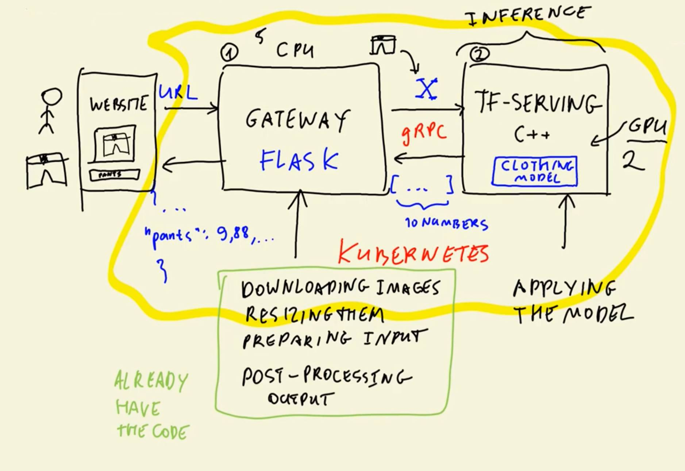
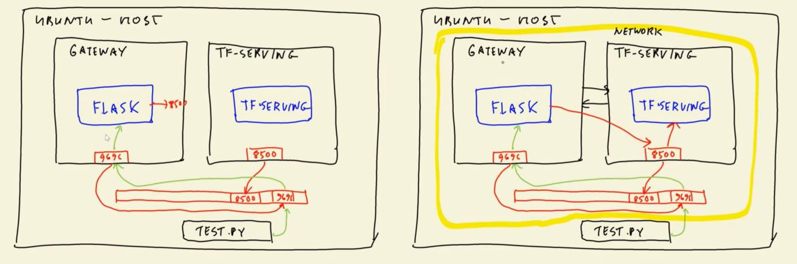
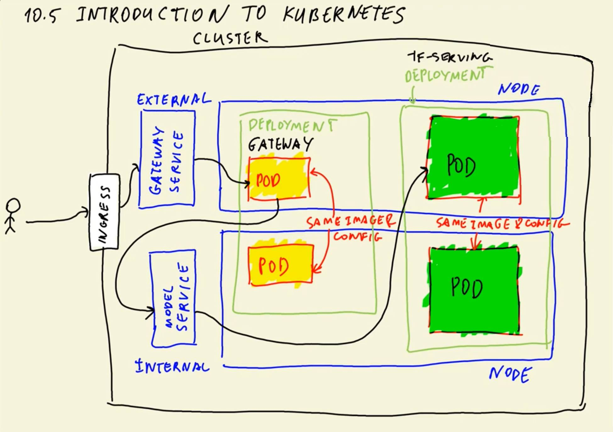
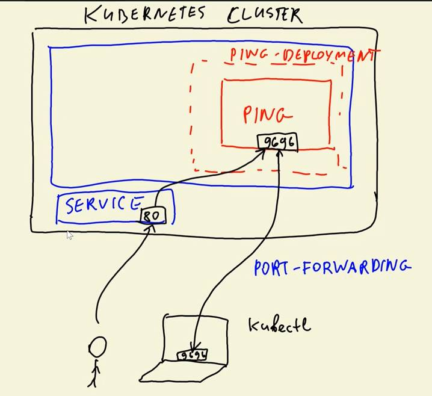
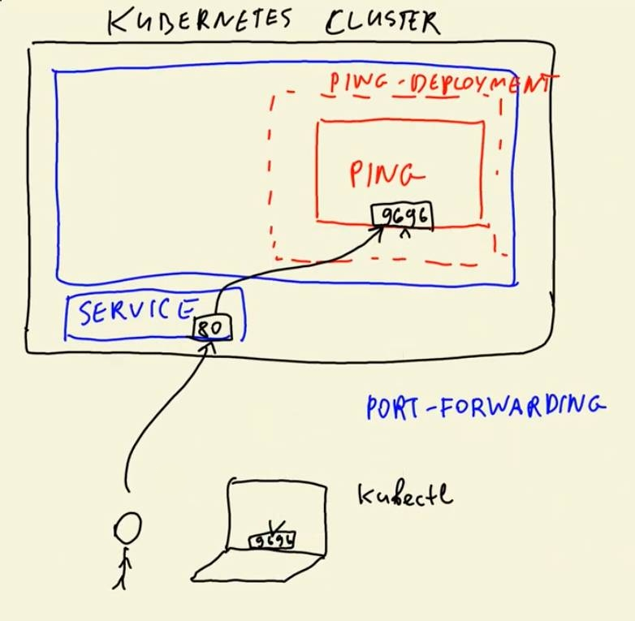

## 10. Kubernetes and TensorFlow Serving

- 10.1 [Overview](#01-overview)
- 10.2 [TensorFlow Serving](#02-tensorflow-serving)
- 10.3 [Creating a pre-processing service](#03-preprocessing)
- 10.4 [Running everything locally with Docker-compose](#04-docker-compose)
- 10.5 [Introduction to Kubernetes](#05-kubernetes-intro)
- 10.6 [Deploying a simple service to Kubernetes](#06-kubernetes-simple-service)
- 10.7 [Deploying TensorFlow models to Kubernetes](#07-kubernetes-tf-serving)
- 10.8 [Deploying to EKS](#08-eks)
- 10.9 [Summary](#09-summary)
- 10.10 [Homework](#homework)

<a id="01-overview"></a>
## 10.1 Overview

- What we will cover this week
- Two-tier architecture


In this Section the same scenario as in previous weeks is used (`clothing classification`) while utilizing `Kubernetes` and `Tensorflow Serving`

### Efficient TensorFlow Serving for image prediction
- TensorFlow-library written in C++ that is specialized to serve trained models
- Can only do inference

### Get predictions from uploaded images

**Website (W):**
- Front-end where a user can provide an Image-URL and then receives a prediction for the given URL
- (W $\rightarrow$ G): Website passes URL to Gateway
- (W $\leftarrow$ G): Receive predictions from Gateway in JSON-format and visualizes them

**Gateway (G):**
- Intermediate service for pre- and post-processing, that uses `Flask`
- Inference-direction
    - (W $\rightarrow$ G): Gets URL from Website, downloads the image and preprocesses it
    - (G $\rightarrow$ T): Sends numpy array to TF-Serving module
- Result-direction
    - (G $\leftarrow$ T): Receives predictions with gRPC and processes it
    - (W $\leftarrow$ G): Sends processed inference-results to the website in JSON-format

**TF-Serving (T):**
- Runs inference on provided numpy arrays
- (G $\rightarrow$ T): Receive pre-processed numpy array
- (G $\leftarrow$ T): Returns predictions with gRPC-protocol




<a id="02-tensorflow-serving"></a>
## 10.2 TensorFlow Serving

- The saved model format
- Running TF-Serving locally with Docker
- Invoking the model from Jupyter

### Converting Keras model into SavedModel format
- The first step is to download the required model
```bash
# Model was saved to the code-directory
wget -c https://github.com/DataTalksClub/machine-learning-zoomcamp/releases/download/chapter7-model/xception_v4_large_08_0.894.h5 -O code/clothing-model-v4.h5
```
- Now the model has to be loaded and converted with the following code:
```python
import tensorflow as tf
from tensorflow import keras

model_path = "clothing-model-v4.h5"
model = keras.models.load_model(model_path)
tf.saved_model.save(model, "clothing-model")
```
- There will be a newly generated folder, in which the `SavedModel` is saved to. To visualize it's content the utility `tree` can be used:
```sh
$ tree clothing-model
 
# Returns:
# clothing-model
# ├── assets
# ├── fingerprint.pb
# ├── saved_model.pb
# └── variables
#     ├── variables.data-00000-of-00001
#     └── variables.index
# 
# 2 directories, 4 files 
```
- Here the `saved_model.pb` contains the model-definition and the content of the variable folder contains the weights of the model
- To get an more in-depth insight into the saved model, the following code can be used:
```sh
saved_model_cli show --dir clothing-model --all
```
- There is a particular section in the output that is interesting. This is because it contains the model-description, which ist the folowing:
```yaml
...
signature_def['serving_default']:
  The given SavedModel SignatureDef contains the following input(s):
    inputs['input_8'] tensor_info:       # 
        dtype: DT_FLOAT                  # Input
        shape: (-1, 299, 299, 3)         # 
        name: serving_default_input_8:0  # 
  The given SavedModel SignatureDef contains the following output(s):
    outputs['dense_7'] tensor_info:      #  
        dtype: DT_FLOAT                  # Output
        shape: (-1, 10)                  # 
        name: StatefulPartitionedCall:0  # 
  Method name is: tensorflow/serving/predict
...
```
- The importance of this particular section comes the need to know the signature of the model when it is invoked (here: `serving_defaults`)
- For later usage the signature, as well as the input and output tensor-info have to be saved in `model-description.txt`
```
serving_default
input_8 - input
dense_7 - output
```

### Running TF-Serving locally with Docker
- To run tf-Serving inside a Docker container you have to follow a scecific procedure
```sh
docker run -it --rm \
    -p 8500:8500 \
    -v "$(pwd)/clothing-model:/models/clothing-model/1" \
    -e MODEL_NAME="clothing-model" \
    tensorflow/serving:2.7.0
```
- **Meaning of all the parameters**
    - **`-p`**: Maps the host port (`8500:`) to the container port (`:8500`)
    - **`-v`**: Maps host volume/folder to container volume/folder (host: `$(pwd)/clothing-model`, container: `/models/clothing-model/1`)
    - **`-e`**: To set environment variable inside container (here: `MODEL_NAME`)
    - **`tensorflow/serving:tag`**: The TF-Serving Docker-Image (with specified tag)
- After running the command above the docker container should be up and running. You can now send requests to the TF-Serving model inside the container.

### Invoking the model from Jupyter
- The relevant code for this can be found inside [this](code/tf-serving-connect.ipynb) notebook.

<a id="03-preprocessing"></a>
## 10.3 Creating a pre-processing service

- Converting the notebook to a Python script
- Wrapping the script into a Flask app
- Putting everything into Pipenv

### Converting the code from the notebook to a Flask-Application
- `Previously`: Used Notebook for communicating with TF-Serving service
- `Now`: Exporting Notebook to Python-Script
```sh
jupyter nbconvert --to script tf-serving-connect.ipynb
```
- Renaming the code to `gateway.py`. This is the software component from the first subsection that connects Website-Inputs to the TF-Serving model and the other way around.


The final code for the `Gateway` can be found [here](code/gateway.py). To utilize communicate with the TF-Serving model you have to use the following code (each command in separate console):
```sh
# Starting the TF-Serving service
docker run -it --rm \
    -p 8500:8500 \
    -v "$(pwd)/clothing-model:/models/clothing-model/1" \
    -e MODEL_NAME="clothing-model" \
    tensorflow/serving:2.7.0

# Gateway Flask-App for communicating with the TF-Serving model
python3 gateway.py

# Script for sending requests to the TF-Serving model
python3 test.py
```
The code:
- `Gateway`: [gateway.py](code/gateway.py)
- `Test-Script`: [test.py](code/test.py)


The results:
```sh
{'dress': -1.868287444114685, 'hat': -4.761244297027588, 'longsleeve': -2.316981554031372, 'outwear': -1.0625675916671753, 'pants': 9.887153625488281, 'shirt': -2.8124289512634277, 'shoes': -3.6662802696228027, 'shorts': 3.200357437133789, 'skirt': -2.6023383140563965, 't-shirt': -4.835044860839844}
```

### Putting everything into Pipenv
**Step 1:** Creating Pipenv-environment with required dependencies
```sh
pipenv install grpcio flask gunicorn keras-image-helper
# Everythign relevant for TF-Serving using gPRC and protobuf
pipenv install tensroflow-protobuf
``` 
- Using [`tensorflow-protobuf`](https://github.com/alexeygrigorev/tensorflow-protobuf) instead of `TensorFlow` (1.7GB dependency)
  - [proto.py](code/proto.py) contains everything relevant for tensorflow

<a id="04-docker-compose"></a>
## 10.4 Running everything locally with Docker-compose

- Preparing the images
- Installing docker-compose
- Running the service
- Testing the service

**Previously**: website/test-script and Gateway outside docker container and TF-Serving model inside docker container
**Now**: Putting Gateway and TF-Serving model into docker container

### Preparing the docker-images
Previously used code for the docker-container of the TF-Serving model
```sh
docker run -it --rm \
    -p 8500:8500 \
    -v $(pwd)/clothing-model:/models/clothing-model/1 \
    -e MODEL_NAME=clothing-model \
    tensorflow/serving:2.7
```
Putting everything into a [Dockerfile](code/image-model.dockerfile) to make it reproducible
```dockerfile
FROM tensorflow/serving:2.7.0
ss
COPY clothing-model /models/clothing-model/1
ENV MODEL_NAME="clothing-model"
```
Building the docker-container:
```sh
docker build -t zoomcamp-10-model:xception-v4-001 -f image-model.dockerfile .
```
Runnung the docker-container
```sh
docker run -it --rm \
    -p 8500:8500 \
    zoomcamp-10-model:xception-v4-001
```
Testing the model
```sh
pipenv run python3 gateway.py
```

Now the gateway has to be put in a docker-container:

The [dockerfile](code/image-gateway.dockerfile) for the Gateway
```dockerfile
FROM python:3.8.12-slim

RUN pip install pipenv
WORKDIR /app
COPY ["Pipfile", "Pipfile.lock", "./"]
RUN pipenv install --system --deploy
RUN pip install numpy
COPY ["gateway.py", "proto.py", "./"]
EXPOSE 9696

ENTRYPOINT [ "gunicorn", "--bind=0.0.0.0:9696", "gateway:app" ]
```
Building the docker-container for the Gateway
```sh
docker build -t zoomcamp-10-gateway:001 -f image-gateway.dockerfile .
```
Running the docker-container of the Gateway
```sh
docker run -it --rm \
    -p 9696:9696 \
    zoomcamp-10-gateway:001
```

Can we just run it now?
# TF-Serving
```sh
docker run -it --rm \
    -p 8500:8500 \
    zoomcamp-10-model:xception-v4-001
```
```sh
# Gateway
docker run -it --rm \
    -p 9696:9696 \
    zoomcamp-10-gateway:001
```

```sh
# "Website" / Test-Script
pipenv run python3 test.py
```
The answer is NO! The gateway-container has no access to the TF-Serving container and a connection has to be established first.
```sh
grpc._channel._InactiveRpcError: <_InactiveRpcError of RPC that terminated with:
	status = StatusCode.UNAVAILABLE
	details = "failed to connect to all addresses; last error: UNKNOWN: ipv4:127.0.0.1:8500: Failed to connect to remote host: Connection refused"
```

The cause of this error is, that the Gateway-container tries to communicate with `http://localhost:8500` which is located inside the gateway docker-container (left). However the address the gateway-service really should connect is the `http://localhost:8500` of the host machine, where the TF-Serving docker-container is connected to.A network connection between the two containers should be established to solve this problem (right).

For the aforementioned purpose the program `docker-compose` is needed. 

#### Installing `docker-compose`: 
- See [here](https://docs.docker.com/compose/) for more information
```sh
# Create folder to place docker-compose binary in
mkdir -p ${HOME}/bin
cd ${HOME}/bin

# Download docker-compose
wget -c https://github.com/docker/compose/releases/download/v2.23.3/docker-compose-$(uname -s)-$(uname -m) -O docker-compose
chmod +x docker-compose
```
To make `docker-compose` accessible systemwide, the path to it has to be added to the `PATH` Environmental-variable:
```sh
# To be added to `.bashrc` (on linux)
export PATH=${HOME}/bin:${PATH}
```
Now that `docker-compose` is set up, it can be used to connect Gateway and TF-Serving containers.

For this purpose a small change to [gateway.py](code/gateway.py) has to be made
```python
# Instead of hardcoded `host = "localhost:8500"`
host = os.getenv("TF_SERVING_HOST", default="localhost:8500")
```
the gateway docker-container has to be updated (tag: `002`)
```sh
docker build -t zoomcamp-10-gateway:002 -f image-gateway.dockerfile .
```

and a docker-compose-configuration ([docker-compose.yaml](code/docker-compose.yaml)) has to be created:
```yaml
version: "3.9"
services:
  clothing-model:
    image: zoomcamp-10-model:xception-v4-001 # TF-Servin container
  gateway:
    image: zoomcamp-10-gateway:002 # the updated gateway container
    environment:
      - TF_SERVING_HOST="clothing-model:8500" # maps to other service
    ports:
      - "9696:9696"
```

All services inside the network, that the file establishes, are now accessible over their name (here: `clothing-model` and `gateway`). Lets test it!

```sh
# In the directory, where `docker-compose.yaml` is located
docker-compose up

# In a different console call
python3 test.py
```

The output:
```python
{'dress': -1.8798637390136719, 'hat': -4.756310939788818, 'longsleeve': -2.359532356262207, 'outwear': -1.0892645120620728, 'pants': 9.903782844543457, 'shirt': -2.8261783123016357, 'shoes': -3.648311138153076, 'shorts': 3.241154432296753, 'skirt': -2.612095355987549, 't-shirt': -4.852035045623779}
```

<a id="05-kubernetes-intro"></a>
## 10.5 Introduction to Kubernetes

- The anatomy of a Kubernetes cluster

### Kubernetes (Abbreviation: K8s)
- Open-source system for automating deployment, scaling, and management of containerized applications.
- Can be used for deploying docker-images

### Main concepts

- **Node**: Server / Computer (EC2 Instance)
- **Pod**: Docker Container (runs on a Node)
- **Deployment**: Groups of Pods with the same Image & Configuration
- **Services**: Entrypoint of an Application. Responsible for routing traffic/requests to all available Pods in a Deployment
    - **External**: Load-Balancer (Can be accessed by clients outside the K8s-cluster)
    - **Internal**: Cluster-IP (Only accessible from within the K8s-cluster)
- **Ingress**: Entrypoint to the cluster
- **HPA**: Horizontal Pod Autoscaler (adapts number of needed Pods for deployment to handle the load)

<a id="06-kubernetes-simple-service"></a>
## 10.6 Deploying a simple service to Kubernetes

- Creating a simple `ping` application in Flask
- Installing `kubectl`
- Setting up a local Kubernetes cluster with Kind
- Create a deployment
- Creating a service

### Installing Creating a simple `ping` application in Flask
1. Preparing the Flask-app [ping.py](code/ping/ping.py):
```sh
mkdir ping
cd ping
# create Pipfile in sub-dir to use this instead of the prev. used one (from parent-dir)
touch Pipfile
# Installing everything relevant Flask
pipenv install flask gunicorn
```

2. Creating a [Dockerfile](code/ping/Dockerfile) for the app:

```dockerfile
FROM python:3.8.12-slim

RUN pip install pipenv
WORKDIR /app
COPY ["Pipfile", "Pipfile.lock", "./"]
RUN pipenv install --system --deploy
COPY "ping.py" .
EXPOSE 9696

ENTRYPOINT [ "gunicorn" , "--bind=0.0.0.0:9696", "ping:app"]
```
3. Building the docker-container
```sh
# Tag-usage advisable when using K8s
docker build -t ping:v001 .
```
4. Running the docker-container
```sh
docker run -it --rm -p 9696:9696 ping:v001
```
5. Testing the Flask-app
```sh
curl localhost:9696/ping
# Output: PONG
```

**Next step**: Deploying to K8s

### Installing `kubectl`
- If you are using *Windows*, `kubectl` is already installed with `docker`
- On *Linux* you have to use the instructions from K8s itself[here](https://kubernetes.io/docs/tasks/tools/install-kubectl-linux/) or from AWS [here](https://docs.aws.amazon.com/eks/latest/userguide/install-kubectl.html). It is advisable to follow the AWS-Version s.t. it can be used on AWS later.
```sh
# Go to the ~/bin/ directory (already in PATH-Variable)
cd ${HOME}/bin
# Download `kubectl`
curl -O https://s3.us-west-2.amazonaws.com/amazon-eks/1.28.3/2023-11-14/bin/linux/amd64/kubectl
# Make it executable
chmod +x kubectl
# Done!
```

### Setting up a local Kubernetes cluster with Kind
1. Installing [`kind`](https://kind.sigs.k8s.io/docs/user/quick-start):
```sh
## Linux ##
cd ${HOME}/bin

# For AMD64 / x86_64
[ $(uname -m) = x86_64 ] && curl -Lo ./kind https://kind.sigs.k8s.io/dl/v0.20.0/kind-linux-amd64
# For ARM64
[ $(uname -m) = aarch64 ] && curl -Lo ./kind https://kind.sigs.k8s.io/dl/v0.20.0/kind-linux-arm64
chmod +x ./kind
```
2. Create your first cluster!
```sh
cd path/to/the/ping/directory/
# Create the cluster (can take several minutes)
kind create cluster
```
3. Configure `kubectl` to know to access `kind-kind`-cluster
```sh
kubectl cluster-info --context kind-kind

### Check to see if it has worked (what services are there) ###
kubectl get service
# Output:
# $ NAME         TYPE        CLUSTER-IP   EXTERNAL-IP   PORT(S)   AGE
# $ kubernetes   ClusterIP   10.96.0.1    <none>        443/TCP   2m28s
kubectl get pod
# Output:
# No resources found in default namespace.
```

### Create a deployment
In this step, you have to create config-files in `yaml`-format
- For deployment: [deployment.yaml](code/ping/deployment.yaml)
```yaml
apiVersion: apps/v1
kind: Deployment
metadata: # Name of deployment
  name: ping-deployment
spec:
  replicas: 1 # How many pod's we want to create
  selector:
    matchLabels: # All pods that have label app="ping" belong to ping-deployment
      app: ping
  template:
    metadata:
      labels: # Each pod get's label app="ping"
        app: ping
    spec:
      containers:
      - name: ping-pod
        image: ping:v001
        resources:
          limits:
            memory: "128Mi"
            cpu: "500m"
        ports:
        - containerPort: 9696
```
Running the deployment in the kubernetes-cluster
```sh
# Do it!
kubectl apply -f deployment.yaml

# Checking the deployment
kubectl get deployment

# Looking into the created pod's
kubectl get pod

# Looking into a specific pod (big amount of info!)
kubectl describe pod ping-deployment-7795dd4bc5-gd9db
```

The deployment of the cluster has created an error in the first try. This is because ther was no image loaded into the cluster. This will be remedied by doing just that:
```sh
kind load docker-image ping:v001

# Checking the pod (should show STATUS "Running")
kubectl get pod
```

Befor creating a service, it is advisable to look into if the deployment is working. For this, the `ping`-Pod inside the deployment has to contacted. To do this port-forwarding has to be used:
```sh
# Connects port of pod to port on host-machine
kubectl port-forward ping-deployment-7795dd4bc5-gd9db 9696:9696
```
Testing the port-forwarding:
```sh
curl localhost:9696/ping
# Output: 
# PONG
```

### Creating a service
In this step, you have to create config-files in `yaml`-format
- For service: [service.yaml](code/ping/service.yaml)
```yaml
apiVersion: v1
kind: Service
metadata:
  name: ping # Name of service
spec:
  type: LoadBalancer # Can be accessed from ouside the cluster
  selector:
    app: ping # To which pod's it needs to forward requests
  ports: # Routs requests on port 80 to port 9696 on the pods 
  - port: 80 # Port in the service (80 is HTTP-port for GET)
    targetPort: 9696 # Port on pod's
```


Now the service is ready to be applied:
```sh
# Apply!
kubectl apply -f service.yaml

# Check if it is running
kubectl get service
```

Now that the service is up and running, the port-forwarding should be to the service, instead of to the pod directly:
```sh
kubectl port-forward service/ping 8080:80
```



<a id="07-kubernetes-tf-serving"></a>
## 10.7 Deploying TensorFlow models to Kubernetes

- Deploying the TF-Service model
- Deploying the Gateway
- Testing the service

### Deploying the TF-Service model
- **Goal**: deploying the TF-Serving pipeline (Gateway and TF-Serving) to kubernetes
- Root-folder of this sction is the folder above `ping`

What to do for the deployment:
1. Create folder `kube-config` 
2. Create deployment-configs for the model ([model-deployment.yaml](code/kube-config/model-deployment.yaml)) inside the folder
3. Load  docker image of clothing-model to `kind`
```sh
kind load docker-image zoomcamp-10-model:xception-v4-001 
```
4. Apply the model-deployment config
```sh
kubectl apply -f model-deployment.yaml
```
5. Testing if the deployed model works
```sh
kubectl port-forward tf-serving-clothing-model-7f555c49b5-pj5lq 8500:8500
```
Call [gateway.py](code/gateway.py) manually with the following code in the bottom-part of the script:
```python
...
if __name__ == "__main__":
    url = "http://bit.ly/mlbookcamp-pants"
    response = predict(url)
    print(response)
    # app.run(debug=True, host="0.0.0.0", port=9696)
```

6. Create and apply a service-config ([model-service.yaml](code/kube-config/model-service.yaml))
```sh
kubectl apply -f model-service.yaml
```
7. Routeing the requests to the pod over the newly created service
```sh
kubectl port-forward service/tf-serving-clothing-model 8500:8500
```
8. Re-running the gateway-script for testing purpose
```sh
pipenv run python3 gateway.py
```

The deployment of the TF-Serving model is now done. Now the Gateway module has to be deployed.

### Deploying the Gateway
1. Creating a deployment-config ([gateway-deployment.yaml](code/kube-config/gateway-deployment.yaml))
2. Load the required docker-image
```sh
kind load docker-image zoomcamp-10-gateway:002
```
3. Log-in to ping-pod to test if paths like in the environmental variable in [gateway-deployment.yaml](code/kube-config/gateway-deployment.yaml) work. They have a similar functionality as in docker-compose.
```sh
# executing the ping-pod and launching into the bash-console
kubectl exec -it ping-deployment-6bd7f4bb95-zfs29 -- bash
```
- **In the pod**: call the ping-function over `localhost`
```sh
# Install curl
apt update && apt install curl
# Test with `localhost` -> accessing the program from within the pod
curl localhost:9696/ping
# Output: PONG
```
- **In the pod**: call the program in the pod over the gateway-service:
```sh
curl ping.default.svc.cluster.local/ping
# Output: PONG
```
- **In the pod**: Call the TF-Serving pod
```sh
# Installing `telnet` (for testing)
apt install telnet
# Connect to the TF-Serving model
telnet tf-serving-clothing-model.default.svc.cluster.local 8500

# Outputs:
# Trying 10.96.225.122...
# Connected to tf-serving-clothing-model.default.svc.cluster.local.
# Escape character is '^]'.
@@ Hello TF-Serving
# Connection closed by foreign host.

### There was a connection established but closed (connection worked). ###
```

4. Finally deploy the gateway 
```sh
kubectl apply -f gateway-deployment.yaml
```

5. Forwarding of Gateway-Port (then getting prediction)
```sh
kubectl port-forward gateway-7d74767d4b-5lpvv 9696:9696
```
```sh
# In another console (should return predictions)
pipenv run python3 test.py
```
6. Creating Gateway-Service from [gateway-service.yaml](code/kube-config/gateway-service.yaml)
```sh
kubectl apply -f gateway-service.yaml
```
7. Port forwarding of port 8080 to port 80 of the gateway-service
```sh
kubectl port-forward service/gateway 8080:80
```

With both gateway and the Tf-Serving model deployed + the services for both, you are now able to send requests from the test-script [test.py](code/test.py). The port in the url has to be changed from 9696 to 8080, since the gateway is not directly accessed anymore.

The final prediction:
```sh
pipenv run python3 test.py
```


**This Section**: Deploying a kubernetes-cluster locally with `kind`.

**Next Section**: Deploying a kubernetes-cluster on the cloud with `EKS`.


<a id="08-eks"></a>
## 10.8 Deploying to EKS

- Creating a EKS cluster on AWS
- Publishing the image to ECR
- Configuring kubectl

A summary of this section can be found [here](https://github.com/joweyel/machine-learning-zoomcamp/blob/master/10-kubernetes/08-eks.md).


<a id="09-summary"></a>
## 10.9 Summary

- TF-Serving is a system for deploying TensorFlow models
- When using TF-Serving, we need a component for pre-processing
- Kubernetes is a container orchestration platform
- To deploy something on Kubernetes, we need to specify a deployment and a service
- You can use Docker compose and Kind for local experiments


<a id="homework"></a>
## 10.11 Homework
- Questions can be found [here](homework/homework.md)
- Solutions can be found [here](homework/solutions.md)
  - The code of the solution is in the sub-folder [homework](homework/).
